# JARKOM MODUL 1 2026 - K-18

## Member

| Nama | NRP |
| --- | --- |
| Catur Setyo Ragil | 5027251066 |
| Senna Bagus Harimurti | 5027251106 |

---

## Daftar Isi

- [Topologi & Addressing](#topologi--addressing)
- [Laporan Praktikum](#laporan-praktikum)
  - [1. Pembangunan Topologi Jaringan](#1-pembangunan-topologi-jaringan)
  - [2. Koneksi Internet Router (Lain)](#2-koneksi-internet-router-lain)
  - [3. Routing Antar Subnet (Semua Client Terhubung)](#3-routing-antar-subnet-semua-client-terhubung)
  - [4. Firewall Masquerade & DNS Resolver per Client](#4-firewall-masquerade--dns-resolver-per-client)
  - [5. Persistensi Konfigurasi Reboot & cek_status.sh](#5-persistensi-konfigurasi-reboot--cek_statussh)
  - [6. Traffic Generator di Mika & Analisis Wireshark](#6-traffic-generator-di-mika--analisis-wireshark)
  - [7. FTP Server vsFTPd di Chisa (The Wired)](#7-ftp-server-vsftpd-di-chisa-the-wired)
  - [8. Praktik FTP Client dari Knights (Upload via Alice)](#8-praktik-ftp-client-dari-knights-upload-via-alice)
  - [9. Download FTP oleh Mika & Bukti Read-Only 550](#9-download-ftp-oleh-mika--bukti-read-only-550)
  - [10. Uji Ketahanan Koneksi & Analisis ICMP Knights ke Chisa](#10-uji-ketahanan-koneksi--analisis-icmp-knights-ke-chisa)
  - [11. Analisis Kelemahan Protokol Telnet & Plaintext Sniffing](#11-analisis-kelemahan-protokol-telnet--plaintext-sniffing)
  - [12. Port Scanning Alice ke Knights & Analisis TCP Flag (SYN-ACK vs RST-ACK)](#12-port-scanning-alice-ke-knights--analisis-tcp-flag-syn-ack-vs-rst-ack)
  - [13. Implementasi OpenSSH Tanpa Password & Analisis Kriptografi Sesi](#13-implementasi-openssh-tanpa-password--analisis-kriptografi-sesi)
  - [14. Analisis Forensik Serangan Web Brute Force (wired_bruteforce)](#14-analisis-forensik-serangan-web-brute-force-wired_bruteforce)
  - [15. Ekstraksi Keystroke USB HID & Reverse Keycode (wired_usb_hid)](#15-ekstraksi-keystroke-usb-hid--reverse-keycode-wired_usb_hid)
  - [16. Investigasi Forensik Pencurian Malware FTP (wired_ftp_theft)](#16-investigasi-forensik-pencurian-malware-ftp-wired_ftp_theft)
  - [17. Analisis Lalu Lintas HTTP C2 Malware Retrieval (wired_http_c2)](#17-analisis-lalu-lintas-http-c2-malware-retrieval-wired_http_c2)
  - [18. Analisis Transfer Eksploitasi SMB Lateral Movement (wired_smb_transfer)](#18-analisis-transfer-eksploitasi-smb-lateral-movement-wired_smb_transfer)
  - [19. Investigasi Ancaman Pemerasan Email SMTP (wired_smtp_threat)](#19-investigasi-ancaman-pemerasan-email-smtp-wired_smtp_threat)
  - [20. Dekripsi Lalu Lintas Terenkripsi TLS/HTTPS (wired_tls_decrypt)](#20-dekripsi-lalu-lintas-terenkripsi-tlshttps-wired_tls_decrypt)

---

## Topologi & Addressing

Sesuai tema *Serial Experiments Lain*, entitas **Lain** bertindak sebagai **Router**, sedangkan entitas lainnya (**Alice, Mika, Chisa, Knights, Eiri**) bertindak sebagai **Client**. Jaringan dibagi ke dalam 3 switch dengan alokasi prefix IP kelompok **K-18** (`192.220.0.0/16`).

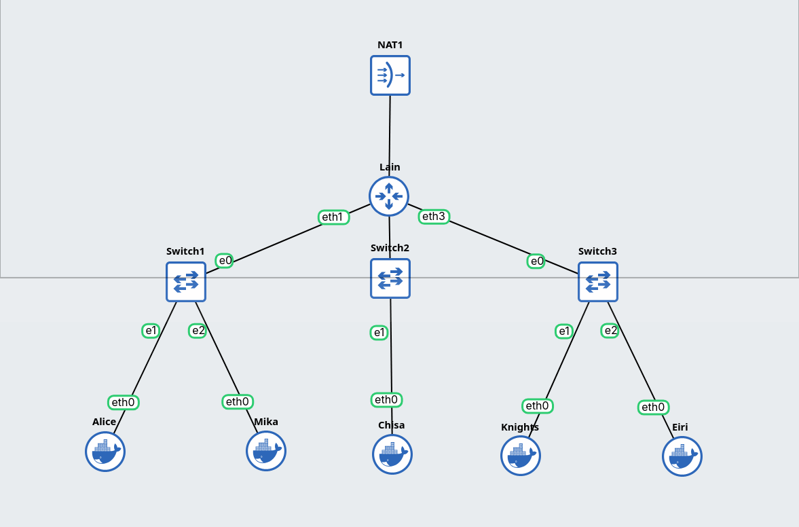

### Tabel Pengalamatan Node

| Node | Peran | Image OS | Switch | Interface | IP Address | Gateway | DNS |
| --- | --- | --- | --- | --- | --- | --- | --- |
| **Lain** | Router | `ardhptr21/debinet:latest` (Debian) | — | eth0<br>eth1<br>eth2<br>eth3 | `192.168.122.2/24`<br>`192.220.1.1/24`<br>`192.220.2.1/24`<br>`192.220.3.1/24` | `192.168.122.1` (eth0) | `8.8.8.8` |
| **Alice** | Client | `ardhptr21/alpinet:latest` (Alpine) | SW1 | eth0 | `192.220.1.2/24` | `192.220.1.1` | `8.8.8.8` |
| **Mika** | Client | `ardhptr21/alpinet:latest` (Alpine) | SW1 | eth0 | `192.220.1.3/24` | `192.220.1.1` | `8.8.8.8` |
| **Chisa** | Client | `ardhptr21/alpinet:latest` (Alpine) | SW2 | eth0 | `192.220.2.2/24` | `192.220.2.1` | `8.8.8.8` |
| **Knights** | Client | `ardhptr21/alpinet:latest` (Alpine) | SW3 | eth0 | `192.220.3.2/24` | `192.220.3.1` | `8.8.8.8` |
| **Eiri** | Client | `ardhptr21/alpinet:latest` (Alpine) | SW3 | eth0 | `192.220.3.3/24` | `192.220.3.1` | `8.8.8.8` |

---

## Laporan Praktikum

### 1. Pembangunan Topologi Jaringan

Untuk menghubungkan entitas di The Wired, **Lain** yang berperan sebagai Router dikonfigurasikan terhubung ke 3 Switch:
- **Switch 1**: Menghubungkan client **Alice** dan **Mika** (Subnet `192.220.1.0/24`).
- **Switch 2**: Menghubungkan client **Chisa** (Subnet `192.220.2.0/24`).
- **Switch 3**: Menghubungkan client **Knights** dan **Eiri** (Subnet `192.220.3.0/24`).


Topologi dibangun di GNS3 dengan rincian komponen:
1. **NAT1**: Node cloud bawaan GNS3 sebagai pintu gerbang menuju jaringan internet nyata (segmen `192.168.122.0/24`).
2. **Router Lain**: Container berbasis Debian (`ardhptr21/debinet:latest`) dengan 4 interface:
   - `eth0` menuju NAT1.
   - `eth1` menuju Switch 1.
   - `eth2` menuju Switch 2.
   - `eth3` menuju Switch 3.
3. **Ethernet Switch (SW1, SW2, SW3)**: Switch generic L2 bawaan GNS3.
4. **Client Nodes (Alice, Mika, Chisa, Knights, Eiri)**: Container berbasis Alpine Linux (`ardhptr21/alpinet:latest`).

---

### 2. Koneksi Internet Router (Lain)

Agar Router Lain dapat terhubung ke internet luar, interface `eth0` dikonfigurasikan agar terhubung ke segmen NAT1 (`192.168.122.0/24`).

Karena image `debinet` merupakan container minimalis yang tidak menyertakan daemon DHCP client (`dhclient` / `ifupdown`), konfigurasi jaringan diterapkan secara statis menggunakan perintah POSIX `ip` pada script `/root/setup-network.sh`:

```sh
# Konfigurasi uplink eth0 ke NAT1 pada Router Lain
ip link set eth0 up
ip addr flush dev eth0
ip addr add 192.168.122.2/24 dev eth0
ip route replace default via 192.168.122.1 dev eth0
echo "nameserver 8.8.8.8" > /etc/resolv.conf
```

**Penjelasan Perintah:**
- `ip link set eth0 up`: Mengaktifkan antarmuka fisik `eth0`.
- `ip addr flush dev eth0`: Menghapus alokasi IP lama/residu agar tidak terjadi multi-IP collision.
- `ip addr add 192.168.122.2/24 dev eth0`: Menetapkan IP address statik pada subnet NAT1.
- `ip route replace default via 192.168.122.1 dev eth0`: Mengarahkan default gateway ke IP gateway NAT1 (`192.168.122.1`).
- `echo "nameserver 8.8.8.8" > /etc/resolv.conf`: Menyetel resolver DNS Google agar router dapat menyelesaikan domain internet.

**Verifikasi Konektivitas Router:**
Pengujian dilakukan dengan melakukan ping ke gateway NAT, DNS publik, serta uji resolusi domain:

```sh
ping -c 3 192.168.122.1
ping -c 3 8.8.8.8
nslookup google.com
```

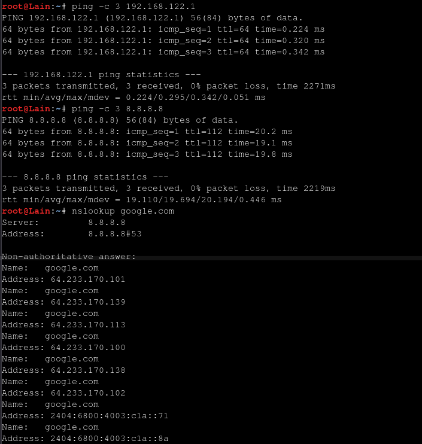

Hasil pengujian membuktikan Router Lain dapat berkomunikasi secara normal dengan jaringan luar (0% packet loss).

---

### 3. Routing Antar Subnet (Semua Client Terhubung)

Agar kelima client dapat saling bertukar data lintas subnet yang berbeda, Router Lain harus mengaktifkan packet forwarding (`ip_forward`) dan masing-masing client harus memiliki alamat IP serta gateway yang mengarah ke interface router pada switch yang bersangkutan.

#### A. Konfigurasi Interface LAN & Forwarding di Router Lain

Pada script `/root/setup-network.sh` di Router Lain, interface `eth1`, `eth2`, dan `eth3` ditetapkan sebagai gateway untuk masing-masing subnet:

```sh
# Alokasi IP interface ke tiap switch
ip link set eth1 up && ip addr flush dev eth1 && ip addr add 192.220.1.1/24 dev eth1
ip link set eth2 up && ip addr flush dev eth2 && ip addr add 192.220.2.1/24 dev eth2
ip link set eth3 up && ip addr flush dev eth3 && ip addr add 192.220.3.1/24 dev eth3

# Mengaktifkan IPv4 packet forwarding
echo 1 > /proc/sys/net/ipv4/ip_forward
```

Perintah `echo 1 > /proc/sys/net/ipv4/ip_forward` memastikan kernel Linux diizinkan meneruskan paket antar-interface (routing layer 3).

#### B. Konfigurasi di Masing-masing Client

Tiap client dikonfigurasi melalui script shell idempotent di `/root/setup-network.sh`:

**Alice (`192.220.1.2/24`, Gateway: `192.220.1.1` - SW1)**
```sh
ip link set eth0 up
ip addr flush dev eth0
ip addr add 192.220.1.2/24 dev eth0
ip route replace default via 192.220.1.1 dev eth0
echo "nameserver 8.8.8.8" > /etc/resolv.conf
```

**Mika (`192.220.1.3/24`, Gateway: `192.220.1.1` - SW1)**
```sh
ip link set eth0 up
ip addr flush dev eth0
ip addr add 192.220.1.3/24 dev eth0
ip route replace default via 192.220.1.1 dev eth0
echo "nameserver 8.8.8.8" > /etc/resolv.conf
```

**Chisa (`192.220.2.2/24`, Gateway: `192.220.2.1` - SW2)**
```sh
ip link set eth0 up
ip addr flush dev eth0
ip addr add 192.220.2.2/24 dev eth0
ip route replace default via 192.220.2.1 dev eth0
echo "nameserver 8.8.8.8" > /etc/resolv.conf
```

**Knights (`192.220.3.2/24`, Gateway: `192.220.3.1` - SW3)**
```sh
ip link set eth0 up
ip addr flush dev eth0
ip addr add 192.220.3.2/24 dev eth0
ip route replace default via 192.220.3.1 dev eth0
echo "nameserver 8.8.8.8" > /etc/resolv.conf
```

**Eiri (`192.220.3.3/24`, Gateway: `192.220.3.1` - SW3)**
```sh
ip link set eth0 up
ip addr flush dev eth0
ip addr add 192.220.3.3/24 dev eth0
ip route replace default via 192.220.3.1 dev eth0
echo "nameserver 8.8.8.8" > /etc/resolv.conf
```

#### C. Verifikasi Pengujian Antar Subnet

Pengujian ping dilakukan melintasi switch yang berbeda untuk memastikan tabel routing router bekerja:

1. **Uji dari Alice (Subnet 1) ke Chisa (Subnet 2) dan Knights (Subnet 3):**
   ```sh
   ping -c 3 192.220.2.2
   ping -c 3 192.220.3.2
   ```

   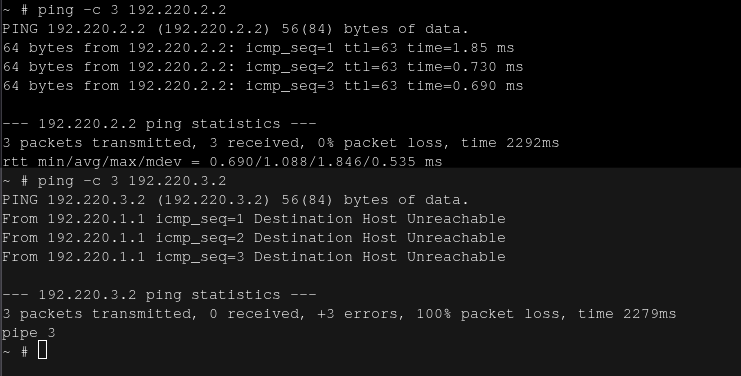

2. **Uji dari Knights (Subnet 3) ke Alice (Subnet 1):**
   ```sh
   ping -c 3 192.220.1.2
   ```

   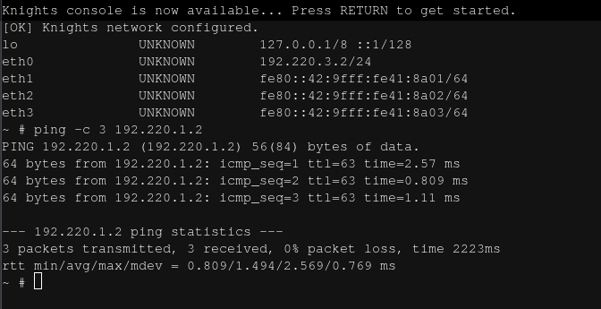

Semua paket ICMP sukses di-reply dengan status RTT stabil dan 0% packet loss.

---

### 4. Firewall Masquerade & DNS Resolver per Client

Agar client tidak hanya bisa saling berkomunikasi lokal tetapi juga dapat mengakses internet secara mandiri (misalnya untuk mengunduh paket via `apk add`), Router Lain harus melakukan translasi alamat jaringan (Network Address Translation / NAT).

#### A. Konfigurasi NAT (iptables) di Router Lain

Aturan NAT MASQUERADE ditambahkan ke tabel `POSTROUTING`:

```sh
if ! iptables -t nat -C POSTROUTING -o eth0 -j MASQUERADE 2>/dev/null; then
    iptables -t nat -A POSTROUTING -o eth0 -j MASQUERADE
fi
```

**Penjelasan Konfigurasi iptables:**
- `-t nat`: Menunjuk ke tabel NAT (Network Address Translation).
- `-A POSTROUTING`: Menambahkan rule ke rantai POSTROUTING (dieksekusi saat paket hendak meninggalkan router).
- `-o eth0`: Rule hanya berlaku untuk lalu lintas keluar menuju interface uplink (`eth0` ke NAT1).
- `-j MASQUERADE`: Mengubah source IP private paket client (`192.220.x.x`) menjadi source IP interface `eth0` router (`192.168.122.2`), sehingga paket dapat diterima kembali dari internet.
- `-C ... || -A ...`: Memastikan rule bersifat idempotent (tidak terduplikasi saat script dijalankan ulang).

#### B. DNS Resolver per Client

Di setiap node client, konfigurasi DNS disetel mengarah ke `8.8.8.8` pada `/etc/resolv.conf`:
```sh
echo "nameserver 8.8.8.8" > /etc/resolv.conf
```

#### C. Verifikasi Internet dari Client

Pengujian dilakukan dari client (contoh: Chisa dan Knights):

```sh
# Tes koneksi IP internet
ping -c 3 8.8.8.8

# Tes resolusi domain internet
nslookup google.com

# Tes instalasi paket via apk Alpine
apk update
```

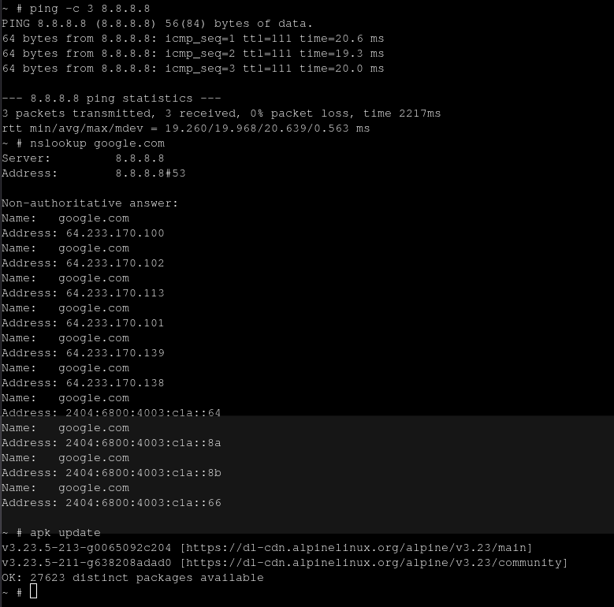

Client berhasil melakukan query DNS ke `8.8.8.8` dan mengunduh paket melalui gateway Router Lain.

---

### 5. Persistensi Konfigurasi Reboot & `cek_status.sh`

Di lingkungan simulasi GNS3, container Docker bersifat stateless secara default bila interface di-reboot. Untuk menjamin seluruh alokasi IP, route, dan firewall tetap bertahan setelah reboot:

#### A. Mekanisme Persistensi GNS3
Setiap node dikonfigurasikan dengan opsi *Custom Start Command* pada pengaturan GNS3 Node:
```sh
sh /root/setup-network.sh && /bin/sh
```
Dengan konfigurasi ini, setiap kali container dijalankan ulang (start/reboot), script inisialisasi jaringan akan langsung dieksekusi secara otomatis sebelum masuk ke shell.

#### B. Script Pemeriksaan `/root/cek_status.sh` di Router Lain
Pada Router Lain, disediakan script diagnosa status jaringan di `/root/cek_status.sh` ([script/cek-status.sh](file:///home/caur/programs/jarkom/modul1/script/cek-status.sh)):

```sh
#!/bin/sh
# /root/cek_status.sh  --  Router (Lain)
set -u

echo "=== cek_status.sh | $(hostname) | $(date '+%Y-%m-%d %H:%M:%S') ==="

echo
echo "--- ip -br a ---"
ip -br a

echo
echo "--- iptables -t nat -L -v -n ---"
iptables -t nat -L -v -n
```

**Verifikasi Eksekusi:**
```sh
chmod +x /root/cek_status.sh
/root/cek_status.sh
```

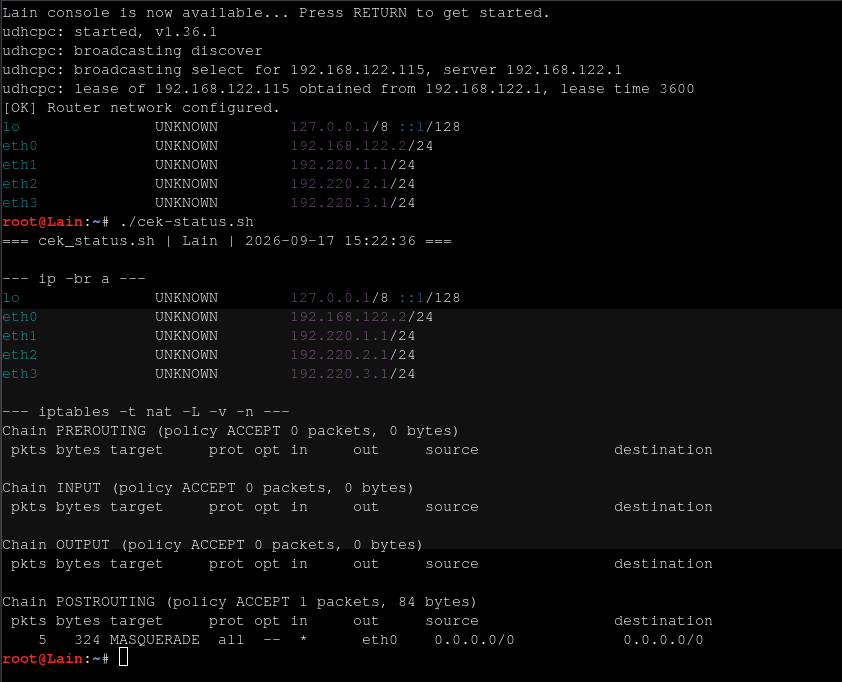

Output menampilkan status 4 interface (`eth0`, `eth1`, `eth2`, `eth3`) dalam kondisi UP dengan IP masing-masing, serta tabel NAT `POSTROUTING` yang memuat rule `MASQUERADE`.

---

### 6. Traffic Generator di Mika & Analisis Wireshark

Pada skenario ini, aktivitas komunikasi di The Wired disimulasikan menggunakan generator traffic pada node **Mika** (`192.220.1.3`). Paket yang melintasi jaringan disniffing dan dianalisis menggunakan Wireshark untuk mengamati lalu lintas protokol **DNS** dan **ICMP**.

#### A. Persiapan Script Generator Traffic
Script generator traffic (`traffic_protocol7.sh` / [script/traffic-mika.sh](file:///home/caur/programs/jarkom/modul1/script/traffic-mika.sh)) dijalankan di node Mika. Script ini membangkitkan lalu lintas jaringan berupa:
1. **Lalu Lintas ICMP**: Melakukan ping menuju DNS resolver `8.8.8.8`, `1.1.1.1`, serta host domain `its.ac.id`.
2. **Query DNS**: Melakukan resolusi nama domain (`nslookup` dan `dig`) untuk `google.com`, `its.ac.id`, `github.com`, `example.com`, dan `cloudflare.com`.

```sh
# Menjalankan traffic generator di node Mika
/root/traffic_protocol7.sh
```

#### B. Hasil Capture Wireshark (`dns or icmp`)

Capture paket dilakukan pada interface link antara node **Mika** dan **Switch 1** (`SW1`). Dengan menerapkan display filter `dns or icmp`, seluruh aktivitas pengiriman query dan pesan echo request/reply tertangkap dengan sempurna (terekam sebanyak 52 paket).

Berkas capture lengkap: [mika-dns-icmp.pcapng](captures/mika-dns-icmp.pcapng)

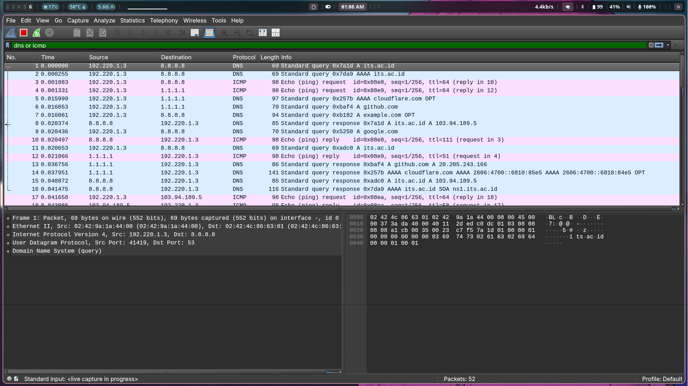

#### C. Analisis Detail Paket

##### 1. Protokol DNS (Domain Name System)
Pengamatan pada **Frame 2** menunjukkan query DNS yang dikirimkan oleh Mika (`192.220.1.3`) menuju DNS server Google (`8.8.8.8`):

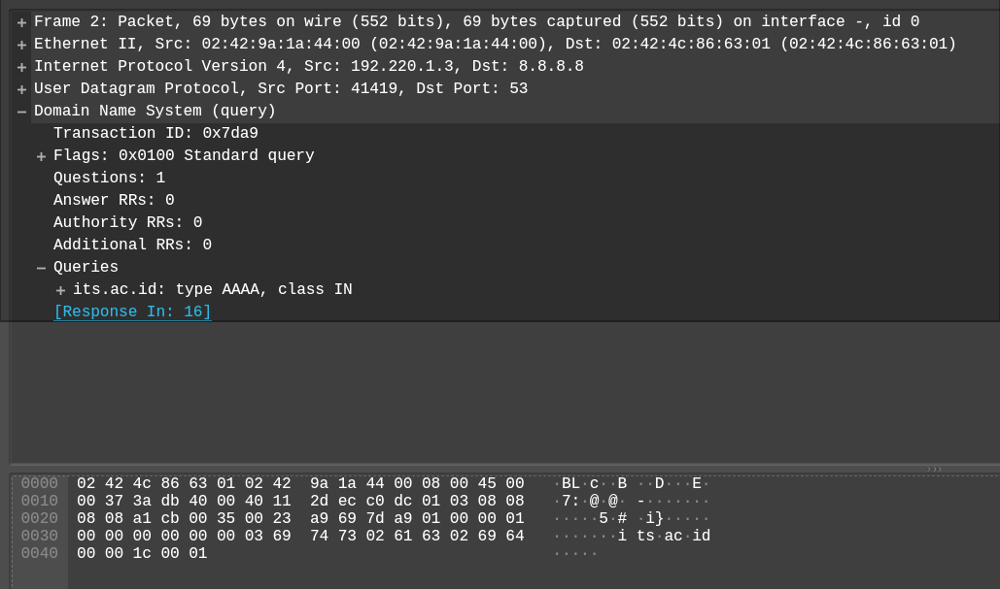

- **Transport Layer**: Protokol User Datagram Protocol (UDP). Source port dialokasikan secara dinamis oleh OS (`41419`), dan destination port adalah port standar DNS (`53`).
- **Transaction ID**: `0x7da9` (digunakan oleh klien untuk mencocokkan respon yang datang dengan query yang dikirim).
- **Flags**: `0x0100` (Standard query, Recursion Desired).
- **Questions**: 1 entri pertanyaan.
- **Queries**: `its.ac.id: type AAAA, class IN` — Mika meminta record alamat IPv6 (AAAA) untuk domain `its.ac.id`.
- **Response**: Dijawab pada Frame 16 dengan respon otoritatif `SOA ns1.its.ac.id`. Selain itu, pada Frame 8 terlihat respon resolusi record A (IPv4) untuk `its.ac.id` yang menghasilkan alamat IP `103.94.189.5`.

##### 2. Protokol ICMP (Internet Control Message Protocol)
Pengamatan pada **Frame 4** menunjukkan pengiriman paket ICMP Echo Request dari Mika (`192.220.1.3`) menuju Cloudflare DNS (`1.1.1.1`):

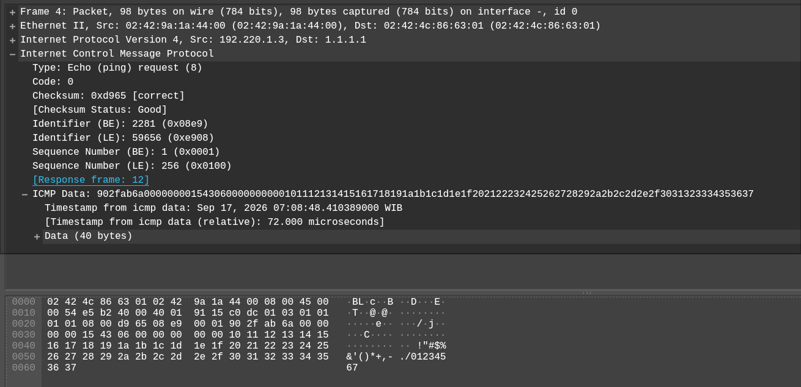

- **Network Layer**: Protokol IPv4, Protocol ID 1 (ICMP), TTL = 64.
- **Type**: `8` (*Echo (ping) request*).
- **Code**: `0`.
- **Checksum**: `0xd965` [correct].
- **Identifier**: `2281` (`0x08e9`).
- **Sequence Number**: `1` (BE: `0x0001`, LE: `0x0100`).
- **ICMP Data Payload**: Berisi data 40 bytes dengan timestamp pengiriman.
- **Response Frame**: Balasan *Echo (ping) reply* (`Type 0, Code 0`) diterima dari `1.1.1.1` pada Frame 12 dengan identifier dan sequence number yang identik (`id=0x08e9, seq=1`), menandakan koneksi round-trip berhasil dengan latensi rendah.

---

### 7. FTP Server vsFTPd di Chisa (The Wired)

Pada node **Chisa**, dibangun server FTP menggunakan `vsftpd` untuk melayani transfer berkas di The Wired dengan spesifikasi keamanan ketat:
- **Shared Folder**: `/var/wired/data`
- **Direktori Log**: `/var/wired` (berkas log `vsftpd.log` dan `xferlog.log`)
- **Hak Akses Pengguna**:
  - `alice`: **Read & Write** (dapat mengunggah dan mengunduh berkas).
  - `mika`: **Read-Only** (hanya dapat melihat dan mengunduh; unggah ditolak error `550`).
  - `eiri`: **Blacklist** (ditolak saat login; error `530`).

Konfigurasi diotomasi menggunakan script [script/setup-ftp-chisa.sh](file:///home/caur/programs/jarkom/modul1/script/setup-ftp-chisa.sh) (dipasang di node sebagai `/root/setup-ftp.sh`).

#### A. Konfigurasi `vsftpd.conf` di Chisa
```conf
listen=YES
listen_ipv6=NO
anonymous_enable=NO
local_enable=YES
write_enable=YES
local_umask=022

chroot_local_user=YES
allow_writeable_chroot=YES
secure_chroot_dir=/var/wired/empty

xferlog_enable=YES
xferlog_file=/var/wired/xferlog.log
dual_log_enable=YES
vsftpd_log_file=/var/wired/vsftpd.log
use_localtime=YES

userlist_enable=YES
userlist_deny=YES
userlist_file=/etc/vsftpd/user_list

user_config_dir=/etc/vsftpd/user_conf

pasv_enable=YES
pasv_min_port=40000
pasv_max_port=40100

pam_service_name=vsftpd
seccomp_sandbox=NO
```

#### B. Aturan Hak Akses Pengguna
1. **User Creation & Directory Permissions**:
   ```sh
   mkdir -p /var/wired/data /var/wired/empty /etc/vsftpd/user_conf /etc/pam.d
   addgroup -S wired
   chown root:wired /var/wired /var/wired/data
   chmod 2775 /var/wired/data
   
   adduser -D -H -h /var/wired/data -s /sbin/nologin -G wired alice
   echo "alice:alice123" | chpasswd
   
   adduser -D -H -h /var/wired/data -s /sbin/nologin -G wired mika
   echo "mika:mika123" | chpasswd
   
   adduser -D -H -h /var/wired -s /sbin/nologin -G wired eiri
   echo "eiri:eiri123" | chpasswd
   ```

2. **Read-Only Mika via `user_config_dir`**:
   Pada `/etc/vsftpd/user_conf/mika`:
   ```text
   write_enable=NO
   ```
   Pengaturan ini menimpa `write_enable=YES` global khusus untuk user Mika, sehingga operasi `STOR` dan `DELE` akan ditolak dengan respon `550 Permission denied`.

3. **Blacklist Eiri via `user_list`**:
   Pada `/etc/vsftpd/user_list`:
   ```text
   eiri
   ```
   Dengan `userlist_enable=YES` dan `userlist_deny=YES`, user yang terdaftar di berkas ini akan langsung ditolak saat mencoba login (`530 Permission denied`).

4. **Konfigurasi Autentikasi PAM di Alpine**:
   Pada `/etc/pam.d/vsftpd`:
   ```text
   auth    required pam_unix.so
   account required pam_unix.so
   session required pam_unix.so
   ```

#### C. Bukti Verifikasi Pengujian

Pengujian dilakukan langsung menggunakan klien FTP:

1. **Uji Akun Alice (Read & Write):**
   Alice berhasil login (`230 Login successful`), mengunggah berkas `signal_alice.txt`, dan melihat daftar direktori:
   ```text
   Connected to 192.220.2.2.
   220 (vsFTPd 3.0.5)
   Name (192.220.2.2:root): alice
   331 Please specify the password.
   Password:
   230 Login successful.
   Remote system type is UNIX.
   Using binary mode to transfer files.
   ftp> put /tmp/signal_alice.txt signal_alice.txt
   200 PORT command successful. Consider using PASV.
   150 Ok to send data.
   226 Transfer complete.
   50 bytes sent in 0.0003 seconds (163.9700 kbytes/s)
   ftp> ls
   200 PORT command successful. Consider using PASV.
   150 Here comes the directory listing.
   -rw-r--r--    1 1000     101            50 Sep 15 18:05 signal_alice.txt
   226 Directory send OK.
   ```
   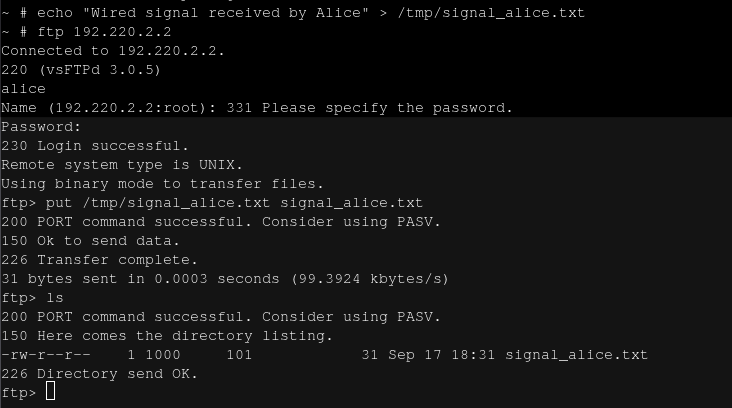

2. **Uji Akun Mika (Read-Only):**
   Mika berhasil login (`230 Login successful`), dapat melihat berkas `signal_alice.txt`, namun ketika mencoba mengunggah berkas, server menolak dengan kode `550`:
   ```text
   Connected to 192.220.2.2.
   220 (vsFTPd 3.0.5)
   Name (192.220.2.2:root): mika
   331 Please specify the password.
   Password:
   230 Login successful.
   Remote system type is UNIX.
   Using binary mode to transfer files.
   ftp> ls
   200 PORT command successful. Consider using PASV.
   150 Here comes the directory listing.
   -rw-r--r--    1 1000     101            50 Sep 15 18:05 signal_alice.txt
   226 Directory send OK.
   ftp> put /tmp/signal_alice.txt test_mika.txt
   200 PORT command successful. Consider using PASV.
   550 Permission denied.
   ```
   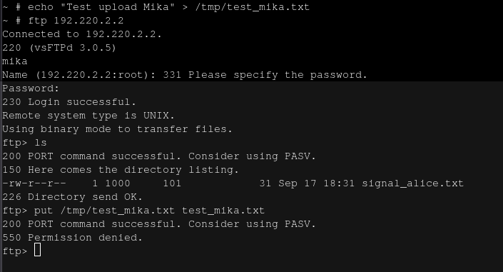

3. **Uji Akun Eiri (Blacklist):**
   Saat user `eiri` mencoba login, vsFTPd langsung menolak autentikasi sesuai daftar `user_list`:
   ```text
   Connected to 192.220.2.2.
   220 (vsFTPd 3.0.5)
   Name (192.220.2.2:root): eiri
   530 Permission denied.
   ftp: Login failed.
   ```
   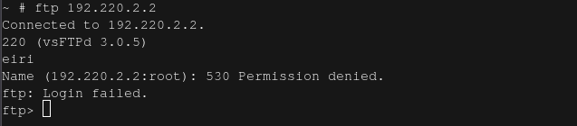

---

### 8. Praktik FTP Client dari Knights (Upload via Alice)

Kelompok rahasia **Knights** (`192.220.3.2`) mengirimkan dokumen intelijen [knights_report.txt](assets/txt/knights_report.txt) (1111 bytes) menuju FTP Server **Chisa** (`192.220.2.2`) dengan menggunakan akun `alice`. Sesi transfer direkam dan dianalisis menggunakan Wireshark.

Berkas capture lengkap: [knights-report.pcapng](captures/knights-report.pcapng)

#### A. Persiapan dan Transfer Berkas di Knights
1. **Pemasangan Klien FTP**: Pada node Knights dipasang paket `inetutils-ftp` via `apk add --no-cache inetutils-ftp`.
2. **Koneksi dan Perintah Upload**:
   ```sh
   cd /root
   ftp 192.220.2.2
   # User: alice | Password: alice123
   ftp> passive
   ftp> put knights_report.txt
   ftp> quit
   ```

   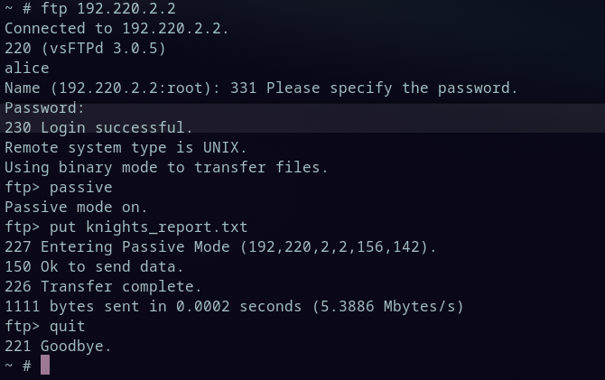

#### B. Hasil Capture Wireshark (`ftp || ftp-data`)

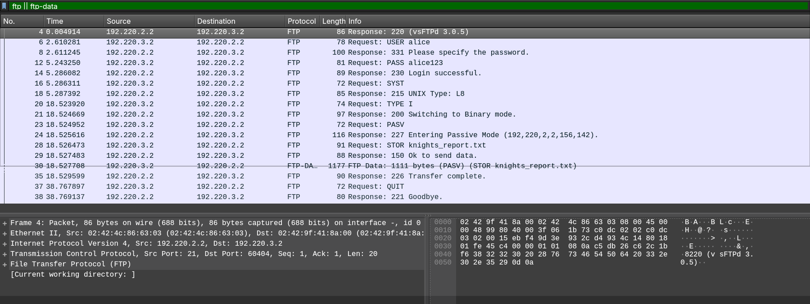

#### C. Analisis Parameter Protokol FTP

Berdasarkan rekaman lalu lintas paket pada berkas [knights-report.pcapng](captures/knights-report.pcapng), diperoleh analisis parameter berikut:

1. **Negosiasi Mode Pasif (PASV) & Perhitungan Port Data TCP**:
   - Pada **Frame 23**, Knights mengirimkan perintah `PASV` untuk meminta server membuka kanal data pasif.
   - Pada **Frame 24**, Chisa merespon:
     ```text
     227 Entering Passive Mode (192,220,2,2,156,142).
     ```
   - Berdasarkan RFC 959, alamat IP server adalah `192.220.2.2` dengan parameter port pasif:
     $$p_1 = 156, \quad p_2 = 142$$
   - Port data TCP yang dinegosiasikan dihitung dengan rumus:
     $$\text{Port Data TCP} = (p_1 \times 256) + p_2 = (156 \times 256) + 142 = 39936 + 142 = \mathbf{40078}$$
   - Nilai port **40078** ini valid dan tepat berada di dalam rentang alokasi pasif `pasv_min_port=40000` hingga `pasv_max_port=40100` pada konfigurasi `vsftpd.conf` Chisa.
   - Pada **Frame 30**, koneksi stream data TCP (`ftp-data`) terbentuk menuju port tujuan `40078` dengan panjang payload 1111 bytes (sesuai ukuran berkas `knights_report.txt`).

2. **Perintah FTP untuk Upload (STOR)**:
   - Pada **Frame 28**, klien Knights mengirimkan instruksi penyimpanan berkas:
     ```text
     Request: STOR knights_report.txt
     ```
   - Server membalas pada **Frame 29**: `150 Ok to send data.`, menandakan server siap menerima transmisi data berkas.

3. **Kode Status Sukses Server (226)**:
   - Setelah seluruh 1111 bytes berkas berhasil ditransmisikan dan koneksi data TCP ditutup, Chisa mengirimkan respon kontrol pada **Frame 35**:
     ```text
     Response: 226 Transfer complete.
     ```
   - Respon status `226` menyatakan bahwa transfer berkas laporan intelijen dari Knights telah sukses dan tersimpan seutuhnya di server.

---

### 9. Download FTP oleh Mika & Bukti Read-Only 550

Pengujian dilakukan dari node **Mika** (`192.220.1.3`) untuk mengunduh dokumen rahasia *"Protokol Tujuh"* ([protocol7_manifesto.txt](assets/txt/protocol7_manifesto.txt)) dari FTP server Chisa (`192.220.2.2`), sekaligus membuktikan pembatasan hak akses *Read-Only* bagi akun `mika` ketika mencoba melakukan modifikasi atau pengunggahan berkas:

#### A. Langkah Pengujian di Terminal Mika

1. **Koneksi dan Autentikasi**:
   - Mika melakukan koneksi FTP ke IP Chisa: `ftp 192.220.2.2`.
   - Memasukkan kredensial: Username `mika` dan Password `mika123`.
   - Autentikasi berhasil dengan respon kontrol `230 Login successful.`.
2. **Mode Pasif & Directory Listing**:
   - Mengaktifkan mode pasif (`passive`) untuk memastikan koneksi kanal data TCP berjalan lancar melintasi router.
   - Menjalankan `ls` untuk memeriksa berkas yang tersedia di folder shared `/var/wired/data`.
   - Terlihat berkas `knights_report.txt` (1111 bytes) hasil unggahan Knights sebelumnya dan `protocol7_manifesto.txt` (1738 bytes).
3. **Pengunduhan Dokumen Protokol Tujuh (RETR)**:
   - Menjalankan perintah `get protocol7_manifesto.txt`.
   - Server merespon:
     ```text
     227 Entering Passive Mode (192,220,2,2,156,132).
     150 Opening BINARY mode data connection for protocol7_manifesto.txt (1738 bytes).
     226 Transfer complete.
     1738 bytes received in 0.0002 seconds (9.3552 Mbytes/s)
     ```
   - Berkas berukuran 1738 bytes berhasil diunduh secara utuh ke direktori lokal Mika.
4. **Pembuktian Penolakan Akses Tulis / Upload (STOR)**:
   - Mencoba mengunggah berkas baru dengan nama `mika_illegal_upload.txt`:
     ```text
     ftp> put protocol7_manifesto.txt mika_illegal_upload.txt
     227 Entering Passive Mode (192,220,2,2,156,76).
     550 Permission denied.
     ```
   - Server menolak operasi upload dengan kode status **`550 Permission denied`**, membuktikan bahwa hak akses akun `mika` dibatasi secara ketat hanya untuk membaca (*read-only*), sesuai spesifikasi berkas konfigurasi user vsFTPd (`write_enable=NO`).
5. **Verifikasi Integritas Berkas Lokal**:
   - Setelah keluar dari sesi FTP (`quit`), verifikasi berkas lokal dilakukan dengan `ls -lh protocol7_manifesto.txt` yang menunjukkan ukuran berkas tepat 1.7K (1738 bytes).

#### B. Bukti Eksekusi Terminal Mika

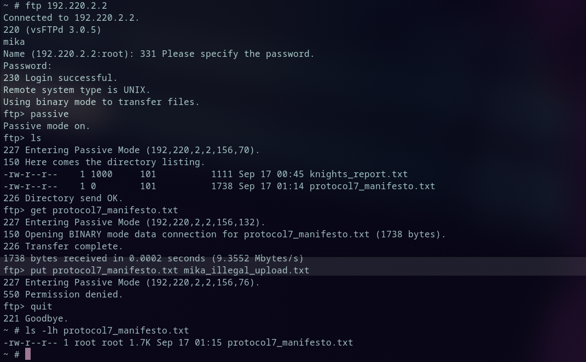

---

### 10. Uji Ketahanan Koneksi & Analisis ICMP Knights ke Chisa

Untuk menguji latensi dan ketahanan transmisi data pada jaringan *The Wired*, node **Knights** (`192.220.3.2`) mengirimkan rentetan paket ping ICMP ke server **Chisa** (`192.220.2.2`) melintasi Switch 3, Router Lain, dan Switch 2.

#### A. Parameter Perintah & Pengujian

Perintah yang dijalankan pada terminal node Knights:

```sh
ping -c 77 -s 128 -i 0.3 192.220.2.2
```

**Penjelasan Parameter:**
- `-c 77`: Mengirimkan tepat **77 paket** *Echo Request*.
- `-s 128`: Mengatur payload data ICMP sebesar **128 bytes**.
  - Total ukuran payload ICMP: $128 \text{ bytes (data)} + 8 \text{ bytes (header ICMP)} = \mathbf{136 \text{ bytes}}$.
  - Total ukuran paket IP layer 3: $136 + 20 \text{ bytes (IPv4 Header)} = \mathbf{156 \text{ bytes}}$.
  - Total ukuran frame Ethernet layer 2: $156 + 14 \text{ bytes (Ethernet II Header)} = \mathbf{170 \text{ bytes}}$ (terkonfirmasi pada Wireshark: *170 bytes on wire*).
- `-i 0.3`: Interval transmisi antar paket sebesar **0.3 detik** (300 milidetik).

#### B. Hasil Pengujian Terminal Knights

Pengujian berjalan selama $\approx 25.66$ detik dengan hasil statistik sebagai berikut:

| Parameter | Nilai Hasil Pengujian | Keterangan |
| --- | --- | --- |
| **Packets Transmitted** | `77` | 77 paket Echo Request dikirimkan |
| **Packets Received** | `77` | 77 paket Echo Reply diterima kembali |
| **Packet Loss** | **`0%`** | Tidak ada paket yang hilang (koneksi stabil sempurna) |
| **Total Waktu** | `25658 ms` | Sesuai durasi interval 77 paket $\times$ 0.3 detik |
| **RTT Minimum (`min`)** | **`0.415 ms`** | Waktu bolak-balik tercepat |
| **RTT Rata-rata (`avg`)** | **`0.593 ms`** | Rata-rata waktu transmisi bolak-balik |
| **RTT Maksimum (`max`)** | **`1.484 ms`** | Waktu bolak-balik terlama |
| **RTT Variasi (`mdev`)** | **`0.140 ms`** | *Mean deviation* / jitter latensi sangat rendah |

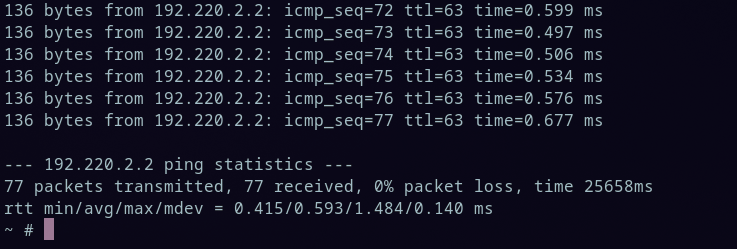

#### C. Analisis Protokol ICMP pada Wireshark

Hasil tangkapan paket tersimpan lengkap pada berkas capture [knights-chisa-ping.pcapng](captures/knights-chisa-ping.pcapng) dengan total 158 frame (154 paket ICMP, terdiri dari 77 pasang Request dan Reply).

Berdasarkan analisis paket, perbedaan protokol antara *Echo Request* dan *Echo Reply* adalah sebagai berikut:

| Atribut Protokol | Echo Request (Knights $\rightarrow$ Chisa) | Echo Reply (Chisa $\rightarrow$ Knights) |
| --- | --- | --- |
| **Source IP** | `192.220.3.2` | `192.220.2.2` |
| **Destination IP** | `192.220.2.2` | `192.220.3.2` |
| **ICMP Type** | **`8`** (*Echo (ping) request*) | **`0`** (*Echo (ping) reply*) |
| **ICMP Code** | **`0`** | **`0`** |
| **Identifier** | `0x0934` (`2356`) | `0x0934` (`2356`) |
| **Sequence Number** | Berurutan `1` hingga `77` | Menjawab sequence number yang bersangkutan |
| **Time to Live (TTL)** | `64` (nilai default kernel pengirim) | `63` (berkurang 1 saat melintasi Router Lain) |
| **Ukuran Frame Wire** | `170 bytes` (1360 bits) | `170 bytes` (1360 bits) |
| **ICMP Data Payload** | `128 bytes` (16 bytes timestamp + 112 bytes data) | `128 bytes` (mengembalikan payload yang sama) |

1. **Detail Paket Echo Request (Type 8, Code 0)**:
   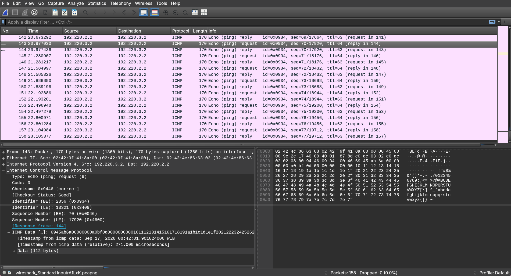
   Pada Frame 143, Knights mengirimkan request ke Chisa dengan Type 8 dan Code 0, memuat 128 bytes data payload dengan identifier `0x0934` dan sequence number `70`.

2. **Detail Paket Echo Reply (Type 0, Code 0)**:
   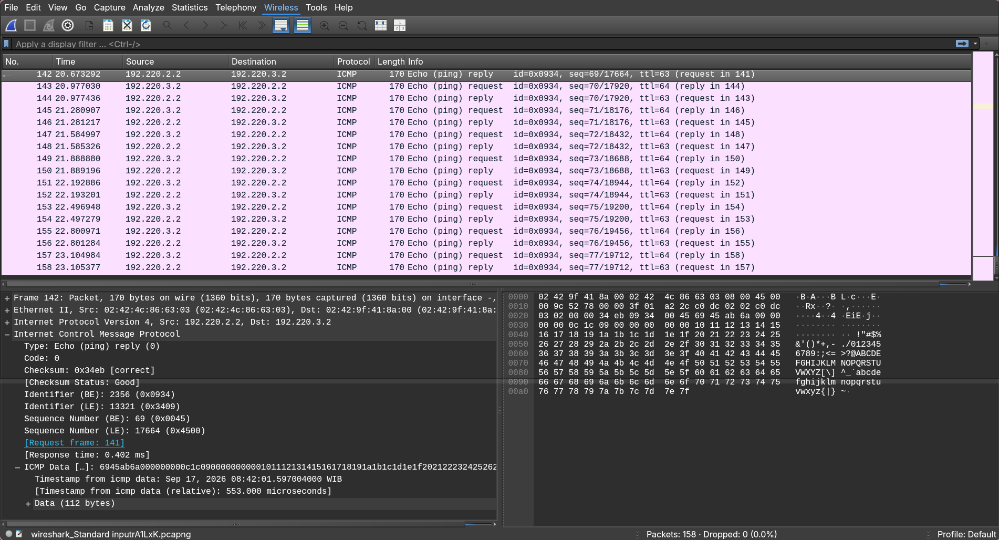
   Pada Frame 142/144, Chisa membalas request tersebut dengan Type 0 dan Code 0, menyalin data identifier dan payload yang sama, dengan nilai TTL teramati 63 pada interface penerima Knights.

---

### 11. Analisis Kelemahan Protokol Telnet & Plaintext Sniffing

Untuk membuktikan kelemahan mendasar protokol **Telnet** (*Telecommunication Network*) yang tidak memiliki enkripsi pada lapisan aplikasi, dilakukan skenario remote access dari node **Eiri** (`192.220.3.3`) ke server **Chisa** (`192.220.2.2`).

#### A. Konfigurasi Server Telnet di Chisa

Layanan Telnet dikonfigurasi pada node Chisa melalui skrip [script/setup-telnet-chisa.sh](script/setup-telnet-chisa.sh):
1. Memasang paket daemon `busybox-extras` yang menyediakan binary `telnetd`.
2. Mendaftarkan user baru `phantom_user` dengan kata sandi `wired_ghost`:
   ```sh
   adduser -D -s /bin/sh phantom_user
   echo "phantom_user:wired_ghost" | chpasswd
   ```
3. Menjalankan daemon `telnetd -p 23` di latar belakang dan memverifikasi status socket `LISTEN` pada port TCP `23`.

#### B. Pengujian Remote Login dari Node Eiri

Dari terminal node Eiri, koneksi remote dilancarkan ke server Chisa:

```sh
telnet 192.220.2.2
```

- **Autentikasi**: Memasukkan username `phantom_user` dan password `wired_ghost`.
- **Verifikasi Sesi**: Mengeksekusi perintah identitas `whoami` dan `id`, yang mengembalikan respon valid:
  - `phantom_user`
  - `uid=1003(phantom_user) gid=1003(phantom_user) groups=1003(phantom_user)`
- **Terminasi**: Keluar dari sesi menggunakan perintah `exit`.

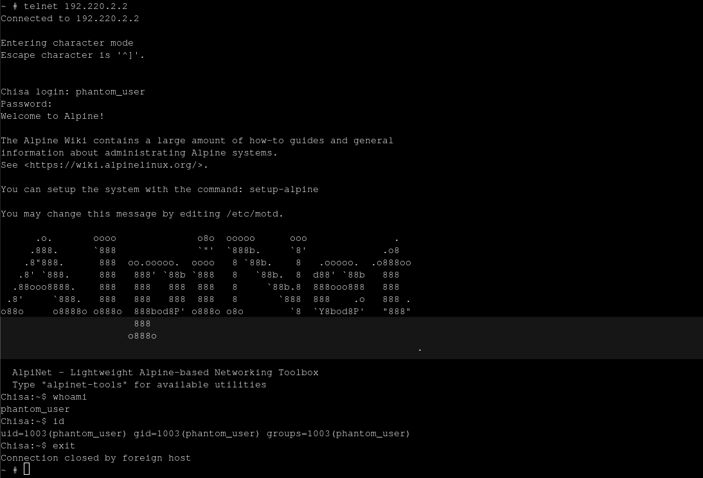

#### C. Analisis Kelemahan Plaintext via Follow TCP Stream

Lalu lintas sesi ditangkap menggunakan Wireshark pada antarmuka jaringan Eiri dan disimpan pada berkas [telnet-session.pcapng](captures/telnet-session.pcapng).

Melalui fitur **Follow TCP Stream** (`tcp.stream eq 1`), seluruh pertukaran data antara klien (merah) dan server (biru) dapat direkonstruksi secara utuh:

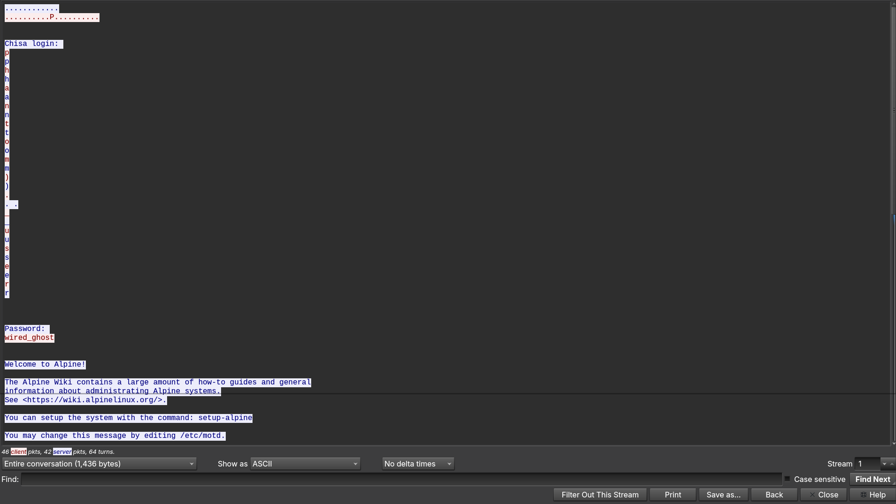

**Temuan Keamanan:**
1. **Kredensial Tidak Terenkripsi**:
   - Username `phantom_user` dan kata sandi `wired_ghost` terkirim dalam format teks polos (*plain text*) murni (ASCII).
   - Pada layar terminal klien, karakter password memang sengaja disembunyikan (*no-echo*) demi mencegah *shoulder surfing*. Namun pada lapisan jaringan (*network wire*), klien mengirimkan setiap karakter kata sandi secara telanjang tanpa adanya mekanisme hashing maupun enkripsi kriptografis (seperti TLS/SSH).
2. **Resiko Sniffing**:
   - Siapa pun penyerang (*eavesdropper* atau *man-in-the-middle*) yang berada di jalur transmisi jaringan dapat menyadap dan membaca kredensial autentikasi dengan sangat mudah.

#### D. Analisis Transmisi Paket per-Karakter (Character-at-a-Time Mode)

Berdasarkan analisis daftar paket pada Wireshark (`captures/telnet-session.pcapng`), setiap penekanan tombol oleh pengguna menghasilkan segmen TCP tersendiri:

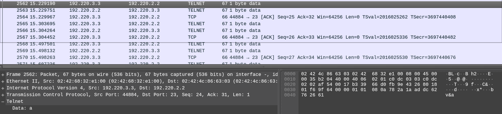

**Penyebab Setiap Karakter Terkirim dalam Paket TCP Terpisah:**

1. **Mode Operasi NVT (*Character-at-a-Time Mode*)**:
   - Berdasarkan standar **RFC 854** dan opsi **RFC 857 (Telnet Echo Option)**, Telnet beroperasi sebagai *Network Virtual Terminal* (NVT) interaktif.
   - Aplikasi klien Telnet tidak melakukan *line-buffering* (tidak menunggu penekanan tombol `Enter`), melainkan mengaktifkan opsi soket `TCP_NODELAY` (menonaktifkan *Nagle's Algorithm*) sehingga setiap penekanan tombol segera dibungkus dan dikirimkan seketika.
2. **Mekanisme Remote Echoing**:
   - Terlihat pada **Frame 2562**, Eiri mengirimkan 1 byte data karakter `a` (`Len: 1`).
   - Pada **Frame 2563**, Chisa merespon dengan mengirimkan kembali (memantulkan) 1 byte data karakter `a` tersebut ke klien.
   - Mekanisme *remote echo* ini dirancang agar server yang memegang kendali penuh atas apa yang dicetak ke layar konsol pengguna.
3. **Responsivitas Sinyal Shell Interaktif**:
   - Pengiriman per-karakter memungkinkan server segera memproses tombol kendali interaktif secara *real-time*, seperti tombol pembatalan proses (`Ctrl+C`), autokompleksi perintah (`Tab`), serta penghapusan karakter (`Backspace`) tanpa harus menunggu baris selesai dikirim.
4. **Overhead Jaringan Tinggi**:
   - Meskipun interaktif, pola ini menghasilkan inefisiensi transmisi yang masif di mana data 1 byte payload dibungkus oleh 20 bytes IP Header + 20 bytes TCP Header + 14 bytes Ethernet Header + 12 bytes TCP Options (total frame mencapai 67 bytes on wire) hanya untuk mentransmisikan satu huruf.

---

### 12. Port Scanning Alice ke Knights & Analisis TCP Flag (SYN-ACK vs RST-ACK)

Untuk mendeteksi layanan yang dijalankan secara rahasia oleh node **Knights** (`192.220.3.2`), node **Alice** (`192.220.1.2`) melakukan pemindaian port (*port scanning*) lintas subnet menggunakan utilitas **Netcat** (`nc`).

#### A. Konfigurasi Layanan di Node Knights

Sebelum pemindaian dijalankan, node Knights dikonfigurasi melalui skrip [script/setup-services-knights.sh](script/setup-services-knights.sh) untuk menyiapkan status port sesuai spesifikasi soal:
1. **Port 22 (SSH - Terbuka)**: Menjalankan daemon `openssh` (`/usr/sbin/sshd`) yang mendengarkan koneksi TCP pada port 22.
2. **Port 80 (HTTP - Terbuka)**: Menjalankan web server bawaan Busybox (`httpd -p 80 -h /var/www/html`) yang mendengarkan koneksi TCP pada port 80.
3. **Port 7777 (Tertutup)**: Memastikan tidak ada daemon atau soket aplikasi yang mendengarkan (*no listening process*) pada port 7777.

#### B. Pemindaian Port dari Node Alice

Pada console node Alice, pemindaian dilakukan menggunakan perintah Netcat dengan flag mode *zero-I/O* (`-z`), pelaporan terperinci (*verbose* `-v`), serta batasan waktu tunggu (*timeout* `-w 2` detik):

```sh
nc -z -v -w 2 192.220.3.2 22
nc -z -v -w 2 192.220.3.2 80
nc -z -v -w 2 192.220.3.2 7777
```

**Hasil Pemindaian di Terminal Alice:**

| Port Target | Layanan | Status Port | Respon Netcat (`nc`) |
| --- | --- | --- | --- |
| **`22`** | SSH | **Terbuka (*Open*)** | `Connection to 192.220.3.2 22 port [tcp/ssh] succeeded!` |
| **`80`** | HTTP | **Terbuka (*Open*)** | `Connection to 192.220.3.2 80 port [tcp/http] succeeded!` |
| **`7777`** | — | **Tertutup (*Closed*)** | `nc: connect to 192.220.3.2 port 7777 (tcp) failed: Connection refused` |

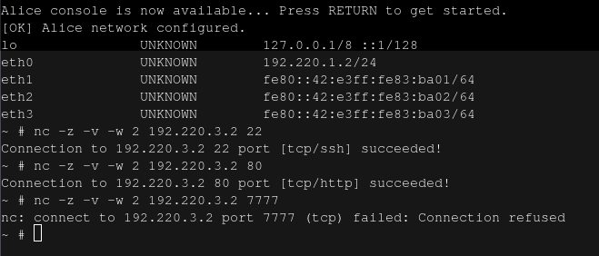

#### C. Analisis Wireshark: Perbedaan TCP Flag (SYN-ACK vs RST-ACK)

Seluruh lalu lintas pemindaian port ditangkap pada Wireshark dan disimpan pada berkas [alice-knights-portscan.pcapng](captures/alice-knights-portscan.pcapng).

Berdasarkan rekaman paket TCP, terdapat perbedaan mendasar pada nilai bit kendali (*Control Flags*) dalam header TCP antara port terbuka dan port tertutup:

| Parameter Header TCP | Port Terbuka (Port 22 & 80) | Port Tertutup (Port 7777) |
| --- | --- | --- |
| **Paket Permintaan (Alice $\rightarrow$ Knights)** | `[SYN]` (Flags: `0x002`) | `[SYN]` (Flags: `0x002`) |
| **Paket Balasan (Knights $\rightarrow$ Alice)** | **`[SYN, ACK]`** | **`[RST, ACK]`** |
| **Nilai Bit Flags Hex** | **`0x012`** | **`0x014`** |
| **Bit SYN** | `Set (1)` | `Not Set (0)` |
| **Bit ACK** | `Set (1)` | `Set (1)` |
| **Bit RST** | `Not Set (0)` | `Set (1)` |
| **Window Size** | Dinamis (`65160`) | `0` |
| **Arti & Fungsi Protokol** | Menerima koneksi & memulai *TCP 3-Way Handshake* | Menolak koneksi (*Connection Refused*) & mereset soket |

1. **Analisis Respon Port Terbuka (`SYN-ACK` - Frame 4 & 13)**:
   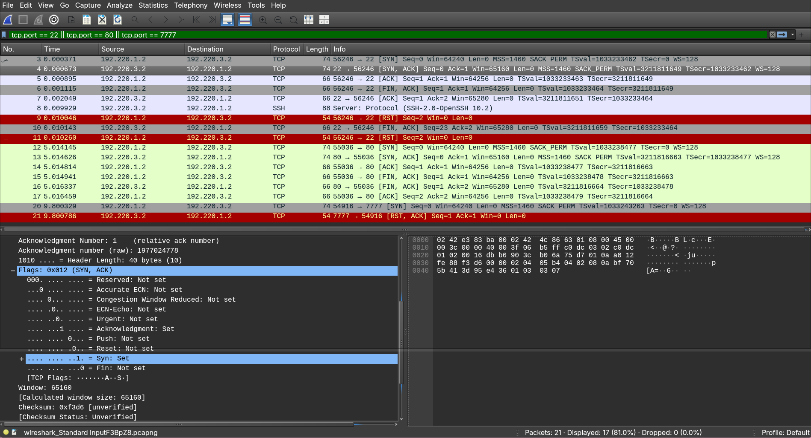
   - Pada **Frame 3**, Alice mengirimkan segmen `[SYN]` dengan Sequence Number `0` ke port 22 Knights.
   - Pada **Frame 4**, Knights membalas dengan segmen **`[SYN, ACK]`** (`Flags: 0x012`), di mana bit **SYN** bernilai `1` dan bit **ACK** bernilai `1` (`Acknowledgment number: 1`).
   - Respon ini menandakan bahwa port 22 (SSH) dan port 80 (HTTP) berada dalam kondisi `LISTEN` pada tabel *Transmission Control Block* (TCB) kernel Knights. Server bersedia mengalokasikan buffer soket dan melanjutkan jabat tangan TCP normal.

2. **Analisis Respon Port Tertutup (`RST-ACK` - Frame 21)**:
   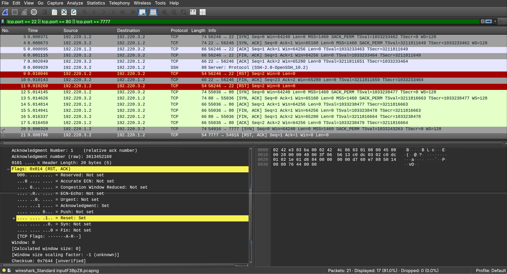
   - Pada **Frame 20**, Alice mengirimkan segmen `[SYN]` dengan Sequence Number `0` ke port 7777 Knights.
   - Pada **Frame 21**, Knights seketika membalas dengan segmen **`[RST, ACK]`** (`Flags: 0x014`), di mana bit **RST (Reset)** bernilai `1`, bit **ACK** bernilai `1`, dan **Window Size** bernilai `0`.
   - Berdasarkan spesifikasi **RFC 793 (TCP Standard)**, apabila segmen SYN tiba pada sebuah port yang tidak memiliki aplikasi/proses yang mendengarkan (*no listening socket*), kernel TCP stack sistem operasi penerima wajib menolak upaya koneksi tersebut secara langsung dengan membangkitkan paket berflag **RST**. Flag ACK disetel untuk memberitahukan pengirim bahwa paket penolakan ini merupakan respon atas segmen SYN yang baru saja dikirimkan, sehingga klien Alice langsung menghentikan koneksi dengan laporan error *"Connection refused"*.

---

### 13. Implementasi OpenSSH Tanpa Password & Analisis Kriptografi Sesi

Untuk mengamankan administrasi jarak jauh lintas subnet, diperintahkan penerapan protokol **Secure Shell (SSH)** pada node **Knights** (`192.220.3.2`) dengan mematikan autentikasi kata sandi (*password authentication*) dan hanya mengizinkan login berbasis kunci publik (*public key authentication*) dari node **Mika** (`192.220.1.3`).

#### A. Konfigurasi OpenSSH Server di Node Knights

Konfigurasi server dilakukan melalui skrip [script/setup-ssh-knights.sh](script/setup-ssh-knights.sh):
1. Memasang paket `openssh` dan membuat akun pengguna administratif `mika_admin`:
   ```sh
   adduser -D -s /bin/sh mika_admin
   ```
2. Menyiapkan direktori penyimpanan kunci publik dengan izin ketat (*StrictModes*):
   ```sh
   mkdir -p /home/mika_admin/.ssh
   chmod 700 /home/mika_admin/.ssh
   touch /home/mika_admin/.ssh/authorized_keys
   chmod 600 /home/mika_admin/.ssh/authorized_keys
   chown -R mika_admin:mika_admin /home/mika_admin
   ```
3. Mengonfigurasi `/etc/ssh/sshd_config` untuk menolak password dan mengaktifkan public key:
   ```text
   PasswordAuthentication no
   PubkeyAuthentication yes
   AuthorizedKeysFile .ssh/authorized_keys
   ```
4. Membangkitkan *host keys* server (`ssh-keygen -A`) dan menjalankan daemon `/usr/sbin/sshd` pada port TCP 22.

#### B. Pembuatan Kunci SSH di Mika & Uji Login Tanpa Password

1. **Pembuatan Pasangan Kunci di Mika**:
   Pada terminal node Mika, dibuat pasangan kunci kriptografi asimetris modern berjenis Ed25519 tanpa *passphrase*:
   ```sh
   ssh-keygen -t ed25519 -N "" -f /root/.ssh/id_ed25519
   ```
   Kunci publik yang dihasilkan (`/root/.ssh/id_ed25519.pub`) kemudian didaftarkan ke berkas `/home/mika_admin/.ssh/authorized_keys` di node Knights.

2. **Pengujian Remote Login Tanpa Password**:
   Mika melakukan koneksi SSH ke Knights menggunakan identitas privatnya:
   ```sh
   ssh -i /root/.ssh/id_ed25519 mika_admin@192.220.3.2
   ```
   Sistem langsung memberikan akses shell secara instan **tanpa meminta kata sandi**. Verifikasi identitas berhasil dengan hasil perintah `whoami` menampilkan pengguna `mika_admin`:

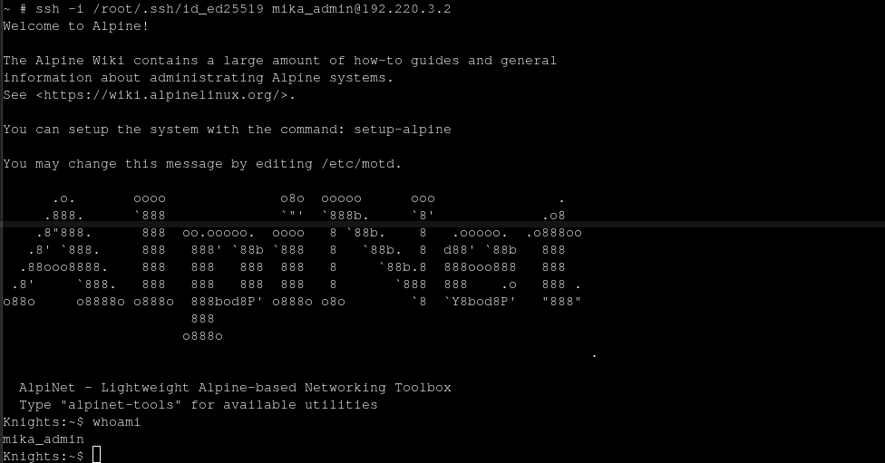

#### C. Analisis Alur Sesi SSH pada Wireshark

Seluruh sesi komunikasi ditangkap menggunakan Wireshark dan disimpan pada berkas [mika-knights-ssh.pcapng](captures/mika-knights-ssh.pcapng) (total 785 paket).

Berikut ikhtisar urutan siklus hidup koneksi SSH yang terekam pada Wireshark:

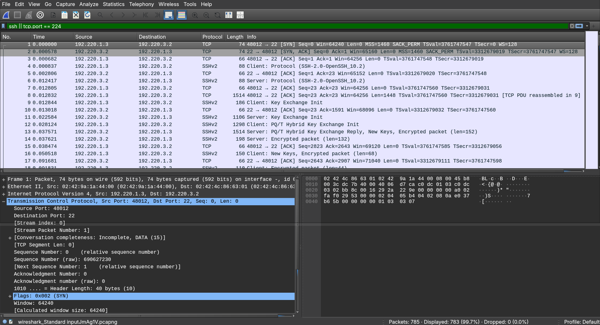

Alur protokol terbagi ke dalam 4 tahapan berurutan:
1. **TCP 3-Way Handshake (Frame 1–3)**: Membentuk koneksi transport TCP layer 4 antara `192.220.1.3:48012` dan `192.220.3.2:22`.
2. **Protocol Version Exchange (Frame 4 & 6)**: Pertukaran identitas versi implementasi SSH.
3. **Key Exchange / KEX (Frame 9–13)**: Negosiasi cipher simetris dan pembentukan kunci sesi bersama (*shared secret*).
4. **New Keys & Encrypted Transport (Frame 13, 16, dst.)**: Pengaktifan enkripsi penuh untuk seluruh paket sesi berikutnya.

---

#### D. Identifikasi Paket Protocol Version Exchange & Key Exchange

1. **Paket Protocol Version Exchange (Frame 4 & Frame 6)**:
   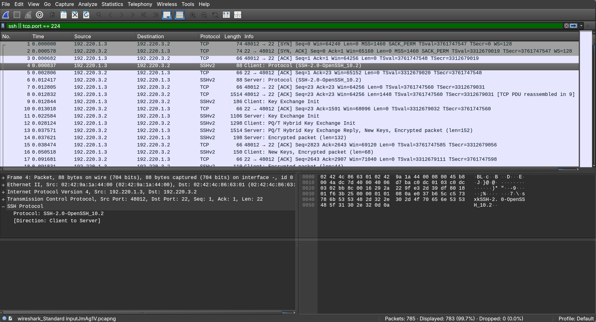
   - Sesuai spesifikasi **RFC 4253 Section 4.2**, tahap awal SSH mewajibkan kedua pihak saling mengirimkan string identitas protokol sebelum data biner lainnya ditransmisikan.
   - Pada **Frame 4**, klien Mika mengirimkan string: `SSH-2.0-OpenSSH_10.2`.
   - Pada **Frame 6**, server Knights membalas dengan string: `SSH-2.0-OpenSSH_10.2`.
   - Melalui paket ini, kedua entitas menyepakati bahwa komunikasi akan menggunakan arsitektur **SSH Protocol Version 2.0**.

2. **Paket Key Exchange (KEX) & New Keys (Frame 9–16)**:
   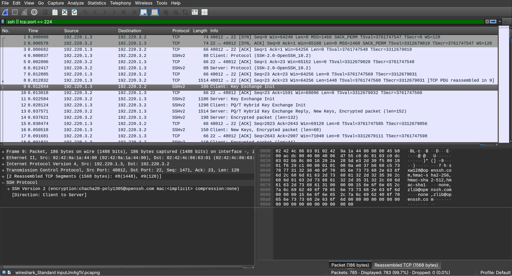
   - **`SSH_MSG_KEXINIT` (Frame 9 & Frame 11)**: Klien dan server saling mengumumkan daftar algoritma yang didukung. Teridentifikasi algoritma enkripsi simetris yang disepakati adalah **`chacha20-poly1305@openssh.com`** serta algoritma *Post-Quantum Hybrid Key Exchange* mutakhir **`mlkem768x25519-sha256`** (kombinasi ML-KEM-768 pasca-kuantum dan X25519).
   - **`SSH_MSG_KEX_ECDH_INIT` & `REPLY` (Frame 12 & 13)**: Pertukaran nilai kunci publik sementara (*ephemeral keys*) untuk menghitung rahasia bersama (*shared secret* $K$) melalui mekanisme Diffie-Hellman tanpa pernah mengirimkan nilai $K$ tersebut melintasi jaringan.
   - **`SSH_MSG_NEWKEYS` (Frame 13 & Frame 16)**: Kedua belah pihak mengirimkan pesan `NEWKEYS` yang menandai bahwa kunci sesi telah berhasil diturunkan (*derived*). Mulai titik ini, seluruh segmen data selanjutnya berubah status menjadi **`Encrypted packet`**.

---

#### E. Mengapa Kredensial Tidak Terlihat Terbuka Seperti pada Telnet?

Berdasarkan analisis arsitektur protokol, terdapat 3 alasan fundamental mengapa kredensial autentikasi pada SSH terlindungi total dari penyadapan jaringan (*packet sniffing*), berbanding terbalik dengan Telnet:

1. **Enkripsi Saluran Mendahului Fase Autentikasi (*Encryption Before Authentication*)**:
   - Pada **Telnet**, autentikasi dilakukan langsung di atas soket TCP polos tanpa enkripsi, sehingga kredensial mengalir sebagai teks ASCII mentah di jaringan.
   - Pada **SSH**, arsitektur protokol dipecah menjadi beberapa lapisan (*RFC 4251*). Lapisan Transport terenkripsi (*SSH Transport Layer Protocol / RFC 4253*) diselesaikan terlebih dahulu hingga tahap `SSH_MSG_NEWKEYS`. Fase autentikasi pengguna (*SSH User Authentication Protocol / RFC 4252*) baru dijalankan **di dalam kanal yang sudah terenkripsi penuh** menggunakan algoritma cipher simetris AEAD (*ChaCha20-Poly1305*).
2. **Mekanisme Autentikasi Kunci Publik Nir-Sandi (*Zero-Knowledge Signature*)**:
   - Pada *Public Key Authentication*, kata sandi pengguna bahkan **tidak pernah ada atau dikirimkan ke server**.
   - Klien membuktikan identitasnya dengan membuat tanda tangan digital kriptografis (*cryptographic signature*) menggunakan *private key* miliknya terhadap data sesi (*session hash challenge*). Server hanya memverifikasi keabsahan tanda tangan tersebut menggunakan *public key* yang terdaftar di `authorized_keys`. *Private key* tetap tersimpan aman di sistem lokal Mika.
3. **Kekebalan Terhadap Eavesdropping & Tampering**:
   - Pihak penyerang yang menyadap lalu lintas menggunakan Wireshark hanya akan melihat deretan data acak (*ciphertext*) berlabel **`Encrypted packet`**. Tanpa kunci simetris sesi yang hanya diketahui oleh memori proses Mika dan Knights, data transmisi mustahil didekripsi ataupun dimanipulasi.

---

### 14. Analisis Forensik Serangan Web Brute Force (wired_bruteforce)

Kasus ini melibatkan investigasi forensik terhadap log paket `wired_bruteforce.pcapng` di mana sebuah entitas mencurigakan melancarkan serangan *web authentication brute force* terhadap aplikasi web target.

#### A. Tabel Artefak & Identifikasi Paket

Berdasarkan penelusuran paket HTTP dan stream TCP pada Wireshark, serangan berhasil diidentifikasi pada **TCP Stream 59**:

| Parameter Insiden | Nilai Artefak | Keterangan & Analisis |
| :--- | :--- | :--- |
| **Filter Wireshark** | `tcp.stream eq 59` | Stream yang memuat percakapan HTTP saat login berhasil |
| **IP Sumber (Penyerang)** | `172.26.7.50` | Alamat IP penyerang yang menjalankan alat fuzzing (*brute-force*) |
| **IP Tujuan (Server)** | `172.26.7.100` | Alamat IP web server target |
| **Port Tujuan** | `8080` (TCP/HTTP) | Layanan HTTP berjalan pada port kustom 8080 |
| **Metode HTTP** | `POST /login.php` | Pengiriman data formulir autentikasi via HTTP POST |
| **User-Agent Tools** | `Fuzz Faster U Fool v2.1.0-dev` | Alat otomatisasi *brute-force* yang digunakan penyerang (`ffuf`) |
| **Username Terkompromi** | `lain_admin` | Nama pengguna akun target yang diserang |
| **Password Ditemukan** | `wired_pr0tocol_7` | Kata sandi valid yang lolos autentikasi |
| **Status Response HTTP** | `200 OK` | Indikasi bahwa permintaan diterima dan sukses diproses |
| **Web Server Software** | `Apache/2.4.62` | Teridentifikasi dari HTTP Response Header `Server` |
| **Runtime Environment** | `PHP/8.3.14` | Teridentifikasi dari HTTP Header `X-Powered-By` |

#### B. Analisis Wireshark & Rekonstruksi Stream

1. **Filter Permintaan HTTP POST dan Respon 200 OK**:
   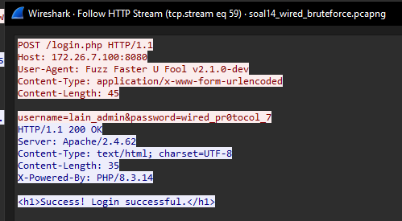

2. **Rekonstruksi Payload Stream (`Follow TCP Stream 59`)**:
   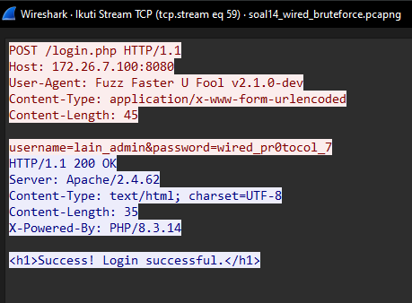

Berikut rekaman utuh transaksi *request* dan *response* saat autentikasi berhasil ditembus:

```http
POST /login.php HTTP/1.1
Host: 172.26.7.100:8080
User-Agent: Fuzz Faster U Fool v2.1.0-dev
Content-Type: application/x-www-form-urlencoded
Content-Length: 45

username=lain_admin&password=wired_pr0tocol_7

HTTP/1.1 200 OK
Server: Apache/2.4.62
Content-Type: text/html; charset=UTF-8
Content-Length: 35
X-Powered-By: PHP/8.3.14

<h1>Success! Login successful.</h1>
```

#### C. Validasi Jawaban ke Socket Server (`nc 10.4.89.246 3401`)

Seluruh parameter temuan forensik divalidasi ke socket server asisten menggunakan Netcat:

```text
$ nc 10.4.89.246 3401

===== Soal 14 - Protocol 7: Web Authentication Attack =====
Difficulty: Easy

What is the IP address of the attacker performing the brute-force attack?
Format: IP
> 172.26.7.50

What is the IP address and port of the target web server?
Format: IP:port
> 172.26.7.100:8080

What is the correct password found by the attacker?
Format: string
> wired_pr0tocol_7

What is the web server software and version running on the target?
Format: Server/x.x.x
> Apache/2.4.62

Congratulations! Here is your flag: KOMJAR26{W1r3d_Brut3_w4KEbR0DyBe2IbHP1yAWOsNel}
```

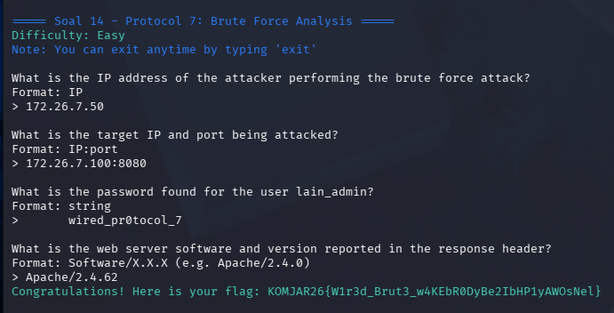

> **Flag Soal 14**: `KOMJAR26{W1r3d_Brut3_w4KEbR0DyBe2IbHP1yAWOsNel}`

---

### 15. Ekstraksi Keystroke USB HID & Reverse Keycode (wired_usb_hid)

Kasus ini berfokus pada rekonstruksi forensik aktivitas pengetikan keyboard USB dari berkas tangkapan paket USB bus `wired_usb_hid.pcap`.

#### A. Identifikasi USB Device Descriptor
* **Langkah Analisis:** Membuka berkas `wired_usb_hid.pcap` di Wireshark, kemudian menerapkan display filter:
  ```text
  usb.idVendor || usb.idProduct
  ```
* **Hasil Identifikasi:**
  * **Vendor ID (idVendor):** `0x046d` (Logitech, Inc.)
  * **Product ID (idProduct):** `0xc31c` (Keyboard K120)

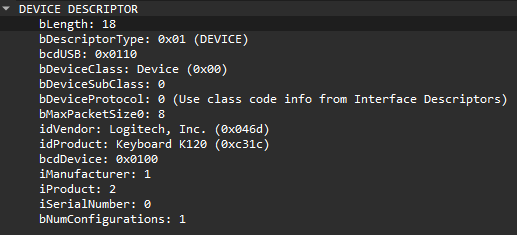

#### B. Identifikasi Device Address dan Filter Data HID
* **Langkah Analisis:** Memeriksa header **USB URB** pada paket transfer data *interrupt* (`URB_INTERRUPT`).
* **Hasil Identifikasi:**
  * **Device Address:** `7`
  * Filter Wireshark yang digunakan untuk mengisolasi data penekanan tombol:
    ```text
    usb.capdata && usb.device_address == 7
    ```

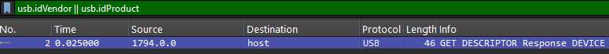


#### C. Ekstraksi dan Menerjemahkan Keystroke Payload
* **Langkah:** Mengekstrak deretan byte dari *Leftover Capture Data* menggunakan `tshark` pada Command Prompt (CMD) Windows:
  ```cmd
  tshark.exe -r "wired_usb_hid.pcap" -Y "usb.capdata && usb.device_address == 7" -T fields -e usb.capdata
  ```
* **Metode Decoding:**
  * **Byte 1:** Status modifier (jika `02`, maka tombol `Shift` aktif).
  * **Byte 3:** USB HID Usage ID (Keycode).
  * Paket `0000000000000000` menandakan kondisi tombol dilepas (*key release*).

**Tabel Rekonstruksi Keystroke Payload (USB HID Data):**

| No. | Raw Hex Payload | Byte 1 (Modifier) | Byte 3 (HID Code) | Interpretasi Tombol | Karakter Terjemahan |
| :---: | :--- | :---: | :---: | :--- | :---: |
| 1 | `02001a0000000000` | `02` (Shift) | `1a` | Key Press (`w` + Shift) | **W** |
| 2 | `0000000000000000` | `00` | `00` | Key Release | *-* |
| 3 | `00000c0000000000` | `00` | `0c` | Key Press (`i`) | **i** |
| 4 | `0000000000000000` | `00` | `00` | Key Release | *-* |
| 5 | `0000150000000000` | `00` | `15` | Key Press (`r`) | **r** |
| 6 | `0000000000000000` | `00` | `00` | Key Release | *-* |
| 7 | `0000080000000000` | `00` | `08` | Key Press (`e`) | **e** |
| 8 | `0000000000000000` | `00` | `00` | Key Release | *-* |
| 9 | `0000070000000000` | `00` | `07` | Key Press (`d`) | **d** |
| 10 | `0000000000000000` | `00` | `00` | Key Release | *-* |
| 11 | `02002d0000000000` | `02` (Shift) | `2d` | Key Press (`-` + Shift) | **_** |
| 12 | `0000000000000000` | `00` | `00` | Key Release | *-* |
| 13 | `0200130000000000` | `02` (Shift) | `13` | Key Press (`p` + Shift) | **P** |
| 14 | `0000000000000000` | `00` | `00` | Key Release | *-* |
| 15 | `0000150000000000` | `00` | `15` | Key Press (`r`) | **r** |
| 16 | `0000000000000000` | `00` | `00` | Key Release | *-* |
| 17 | `0000120000000000` | `00` | `12` | Key Press (`o`) | **o** |
| 18 | `0000000000000000` | `00` | `00` | Key Release | *-* |
| 19 | `0000170000000000` | `00` | `17` | Key Press (`t`) | **t** |
| 20 | `0000000000000000` | `00` | `00` | Key Release | *-* |
| 21 | `0000120000000000` | `00` | `12` | Key Press (`o`) | **o** |
| 22 | `0000000000000000` | `00` | `00` | Key Release | *-* |
| 23 | `0000060000000000` | `00` | `06` | Key Press (`c`) | **c** |
| 24 | `0000000000000000` | `00` | `00` | Key Release | *-* |
| 25 | `0000120000000000` | `00` | `12` | Key Press (`o`) | **o** |
| 26 | `0000000000000000` | `00` | `00` | Key Release | *-* |
| 27 | `00000f0000000000` | `00` | `0f` | Key Press (`l`) | **l** |
| 28 | `0000000000000000` | `00` | `00` | Key Release | *-* |
| 29 | `02002d0000000000` | `02` (Shift) | `2d` | Key Press (`-` + Shift) | **_** |
| 30 | `0000000000000000` | `00` | `00` | Key Release | *-* |
| 31 | `0000240000000000` | `00` | `24` | Key Press (`7`) | **7** |
| 32 | `0000000000000000` | `00` | `00` | Key Release | *-* |
| 33 | `02002d0000000000` | `02` (Shift) | `2d` | Key Press (`-` + Shift) | **_** |
| 34 | `0000000000000000` | `00` | `00` | Key Release | *-* |
| 35 | `00000c0000000000` | `00` | `0c` | Key Press (`i`) | **i** |
| 36 | `0000000000000000` | `00` | `00` | Key Release | *-* |
| 37 | `0000160000000000` | `00` | `16` | Key Press (`s`) | **s** |
| 38 | `0000000000000000` | `00` | `00` | Key Release | *-* |
| 39 | `02002d0000000000` | `02` (Shift) | `2d` | Key Press (`-` + Shift) | **_** |
| 40 | `0000000000000000` | `00` | `00` | Key Release | *-* |
| 41 | `0000040000000000` | `00` | `04` | Key Press (`a`) | **a** |
| 42 | `0000000000000000` | `00` | `00` | Key Release | *-* |
| 43 | `00000f0000000000` | `00` | `0f` | Key Press (`l`) | **l** |
| 44 | `0000000000000000` | `00` | `00` | Key Release | *-* |
| 45 | `00000c0000000000` | `00` | `0c` | Key Press (`i`) | **i** |
| 46 | `0000000000000000` | `00` | `00` | Key Release | *-* |
| 47 | `0000190000000000` | `00` | `19` | Key Press (`v`) | **v** |
| 48 | `0000000000000000` | `00` | `00` | Key Release | *-* |
| 49 | `0000080000000000` | `00` | `08` | Key Press (`e`) | **e** |
| 50 | `0000000000000000` | `00` | `00` | Key Release | *-* |
| 51 | `02002d0000000000` | `02` (Shift) | `2d` | Key Press (`-` + Shift) | **_** |
| 52 | `0000000000000000` | `00` | `00` | Key Release | *-* |
| 53 | `00001f0000000000` | `00` | `1f` | Key Press (`2`) | **2** |
| 54 | `0000000000000000` | `00` | `00` | Key Release | *-* |
| 55 | `0000270000000000` | `00` | `27` | Key Press (`0`) | **0** |
| 56 | `0000000000000000` | `00` | `00` | Key Release | *-* |
| 57 | `00001f0000000000` | `00` | `1f` | Key Press (`2`) | **2** |
| 58 | `0000000000000000` | `00` | `00` | Key Release | *-* |
| 59 | `0000230000000000` | `00` | `23` | Key Press (`6`) | **6** |
| 60 | `0000000000000000` | `00` | `00` | Key Release | *-* |


#### D. Validasi Jawaban ke Socket Server (`nc 10.4.89.246 3402`)

Seluruh parameter hasil decoding USB HID divalidasi ke socket server validator:

```text
$ nc 10.4.89.246 3402

===== Soal 15 - Protocol 7: USB HID Keystroke Analysis =====
Difficulty: Medium

What is the USB Vendor ID of the captured keyboard device?
Format: 4 hex digits (e.g., 046d)
> 046d

What is the USB Product ID of the captured keyboard device?
Format: 4 hex digits (e.g., c31c)
> c31c

What is the USB device address assigned to the keyboard?
Format: int
> 7

What is the secret message typed on the keyboard?
Format: string
> Wired_Protocol_7_is_alive_2026

Congratulations! Here is your flag: KOMJAR26{USB_K3ystr0k3_U7df8Gg33BDCK3rk0pY59RAkN}
```

> **Flag Soal 15**: `KOMJAR26{USB_K3ystr0k3_U7df8Gg33BDCK3rk0pY59RAkN}`

---
### 16. Investigasi Forensik Pencurian Malware FTP (wired_ftp_theft)

Kasus ini menginvestigasi insiden eksfiltrasi/pengunduhan berkas *malware* (`knights_payload.exe`) dari sebuah FTP Server berdasarkan rekaman paket `wired_ftp_theft.pcap`.

#### A. Ringkasan Kasus & Temuan Utama

Berdasarkan analisis protokol FTP dan penelusuran alur *TCP Stream*, didapatkan rincian informasi server serta kredensial penyerang sebagai berikut:

| Parameter Insiden | Nilai Temuan Forensik | Keterangan & Analisis |
| :--- | :--- | :--- |
| **FTP Server IP Address** | `198.51.100.7` | Alamat IP server FTP target |
| **FTP Server Software Banner** | `vsftpd 3.0.5` | Versi daemon FTP pada respons pembuka `220` |
| **Attacker Username** | `knights_agent` | Akun pengguna yang digunakan saat login (`USER`) |
| **Attacker Password** | `N4v1_s3cur3_2026` | Kata sandi akun penyerang (`PASS`) |
| **Malware File Name** | `knights_payload.exe` | Nama berkas *payload* yang diunduh (`RETR`) |
| **Malware File Size** | `524288` bytes | Ukuran berkas biner (tercatat 512 KiB) |

#### B. Langkah-Langkah Analisis (Wireshark Workflow)

1. **Filter Lalu Lintas FTP**:
   Membuka file pcap pada aplikasi Wireshark, kemudian menerapkan display filter untuk menampilkan perintah kontrol FTP:
   ```text
   ftp || ftp-data
   ```
   Atau untuk langsung menuju ke permintaan pengunduhan berkas biner:
   ```text
   ftp.request.command == "RETR"
   ```

2. **Identifikasi Sesi Penyerang**:
   Pada daftar paket yang terfilter, teridentifikasi paket transfer dengan perintah `RETR knights_payload.exe` dan banner sambutan server `220 Welcome to Wired FTP Server (vsftpd 3.0.5)`.
   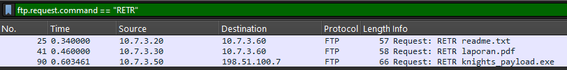

3. **Mengikuti Alur Percakapan (*Follow TCP Stream*)**:
   Klik kanan pada baris paket sesi login `knights_agent`, lalu pilih **Follow > TCP Stream** untuk merekonstruksi dialog interaktif protokol:
   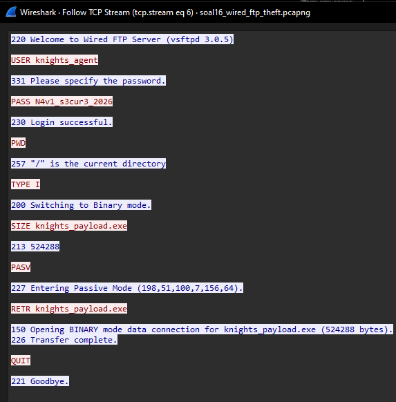

#### C. Validasi Jawaban ke Socket Server (`nc 10.4.89.246 3403`)

Seluruh parameter temuan divalidasi ke socket server validator:

```text
$ nc 10.4.89.246 3403

===== Soal 16 - Protocol 7: FTP Data Exfiltration =====
Difficulty: Medium

What is the IP address of the FTP server where the file was downloaded from?
Format: IP
> 198.51.100.7

What is the FTP server software name and version from the banner?
Format: name x.x.x (e.g., vsftpd 3.0.5)
> vsftpd 3.0.5

What are the credentials used by the attacker to login?
Format: username:password
> knights_agent:N4v1_s3cur3_2026

What is the exact size of the downloaded malware file in bytes?
Format: int
> 524288

Congratulations! Here is your flag: KOMJAR26{FTP_Th3ft_XNs3pPZAyWllYl233HSz8o5AP}
```

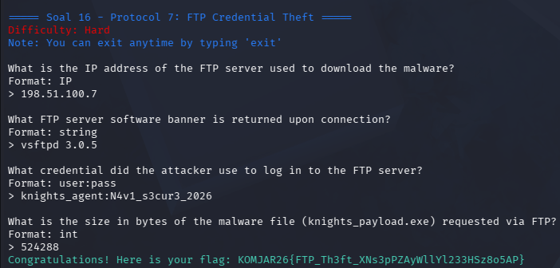

> **Flag Soal 16**: `KOMJAR26{FTP_Th3ft_XNs3pPZAyWllYl233HSz8o5AP}`

---
### 17. Analisis Lalu Lintas HTTP C2 Malware Retrieval (wired_http_c2)

Kasus ini menginvestigasi aktivitas pengunduhan artefak berbahaya dari server Command & Control (C2) melalui protokol HTTP berdasarkan rekaman paket `wired_http_c2.pcap`.

#### A. Informasi Analisis & Display Filter

* **File Analisis:** `wired_http_c2.pcap`
* **Socket Server Validator:** `nc 10.4.89.246 3404`
* **Filter Wireshark yang Digunakan:**
  ```text
  http.host == "wired-update.net" || http
  ```

#### B. Tabel Artefak & Identifikasi Forensik

Berdasarkan analisis paket HTTP request dan response, diperoleh artefak komunikasi C2 sebagai berikut:

| Parameter Analisis | Nilai Temuan Forensik | Keterangan & Analisis |
| :--- | :--- | :--- |
| **Domain Name (Host)** | `wired-update.net` | Host domain server C2 tempat mengunduh berkas |
| **IP Address Web Server** | `203.0.113.42` | Alamat IP publik server C2 hosting *payload* |
| **Filename Malware Payload** | `navi_agent.exe` | Berkas eksekutabel agen *malware* yang diunduh korban |
| **HTTP Status Code** | `200` (OK) | Respons server yang menandakan *payload* berhasil diunduh |

#### C. Validasi Jawaban ke Socket Server (`nc 10.4.89.246 3404`)

Seluruh parameter divalidasi ke socket server validator:

```text
$ nc 10.4.89.246 3404

===== Soal 17 - Protocol 7: HTTP Malware Retrieval =====
Difficulty: Hard

What is the domain name (Host) where the suspicious files were downloaded from?
Format: domain.com
> wired-update.net

What is the IP address of the web server hosting the malicious files?
Format: IP
> 203.0.113.42

What is the filename of the executable malware payload downloaded by the client?
Format: file.exe
> navi_agent.exe

What is the HTTP status response code returned when downloading navi_agent.exe?
Format: int
> 200

Congratulations! Here is your flag: KOMJAR26{Navi_C2_D0wnl04d_w4JTL2z3h84M3Q6wOCq9jpwUZ}
```

> **Flag Soal 17**: `KOMJAR26{Navi_C2_D0wnl04d_w4JTL2z3h84M3Q6wOCq9jpwUZ}`

---

### 18. Analisis Transfer Eksploitasi SMB Lateral Movement (wired_smb_transfer)

Kasus ini berfokus pada analisis transmisi *lateral movement* di jaringan lokal di mana berkas trojan dipindahkan antar host menggunakan protokol Server Message Block (SMB) berdasarkan log `wired_smb_transfer.pcapng`.

#### A. Langkah-Langkah Analisis Forensik

1. **Membuka File Tangkapan Paket**: Membuka `wired_smb_transfer.pcapng` di Wireshark.
2. **Filter Protokol & Penelusuran Sesi**:
   - Menerapkan filter display `smb || smb2` untuk mengisolasi percakapan SMB.
   - Melakukan penelusuran tree connect menuju *administrative share* default Windows `ADMIN$`.
   - Menemukan transaksi penulisan berkas *executable* berbahaya bernama `wired_trojan_payload.exe` dari mesin penyerang ke mesin korban.

#### B. Tabel Artefak & Identifikasi Paket

| Parameter Analisis | Nilai / Jawaban | Keterangan & Analisis |
| :--- | :--- | :--- |
| **Protokol Jaringan** | `smb` | Protokol transfer file lokal yang dieksploitasi |
| **IP Sumber (Source Host)** | `10.7.3.100` | Alamat IP inisiator transfer berkas *malware* |
| **IP Korban (Victim Host)** | `10.7.1.50` | Alamat IP target tempat berkas berbahaya disalin |
| **Target Share / Direktori** | `ADMIN$` | *Hidden administrative share* yang diakses pada target |
| **Filename Executable Malware** | `wired_trojan_payload.exe` | Berkas biner trojan yang ditransfer via SMB |

#### C. Validasi Jawaban ke Socket Server (`nc 10.4.89.246 3405`)

Seluruh temuan divalidasi ke socket server validator:

```text
$ nc 10.4.89.246 3405

===== Soal 18 - Protocol 7: SMB Lateral Transfer =====
Difficulty: Hard

What protocol was used to transfer the suspicious files laterally between hosts?
Format: protocol name (lowercase)
> smb

What is the source IP address of the host initiating the file transfer?
Format: IP
> 10.7.3.100

What is the destination/victim IP address where the file was written to?
Format: IP
> 10.7.1.50

What is the SMB share name (Tree) that was accessed during the transfer?
Format: SHARE$
> ADMIN$

What is the filename of the malware executable transferred over the SMB share?
Format: file.exe
> wired_trojan_payload.exe

Congratulations! Here is your flag: KOMJAR26{SMB_Tr4nsf3r_vPpldnM28toBBf2Zxem0DyFDw}
```

> **Flag Soal 18**: `KOMJAR26{SMB_Tr4nsf3r_vPpldnM28toBBf2Zxem0DyFDw}`

---

### 19. Investigasi Ancaman Pemerasan Email SMTP (wired_smtp_threat)

Kasus ini menangani investigasi insiden email pemerasan (*extortion email*) yang dikirimkan melalui protokol Simple Mail Transfer Protocol (SMTP) berdasarkan berkas tangkapan paket `wired_smtp_threat.pcap`.

#### A. Langkah-Langkah Analisis Forensik

1. **Membuka Berkas PCAP**: Membuka berkas `wired_smtp_threat.pcap` menggunakan Wireshark.
2. **Filter Berdasarkan TCP Stream**: 
   Menerapkan display filter `tcp.stream eq 6` untuk mengisolasi sesi pertukaran email antara alamat penyerang (`attacker@darkwired.net`) dan korban (`victim@protocol7.co.jp`).
   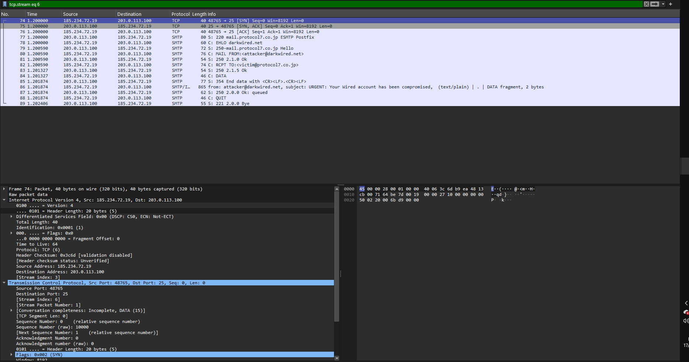

3. **Rekonstruksi Pesan Email (*Follow TCP Stream*)**:
   Melakukan inspeksi mendalam terhadap baris perintah SMTP (`MAIL FROM`, `RCPT TO`) dan bagian isi pesan (*DATA*) yang memuat klaim kebocoran kredensial dan ancaman penyebaran data.
   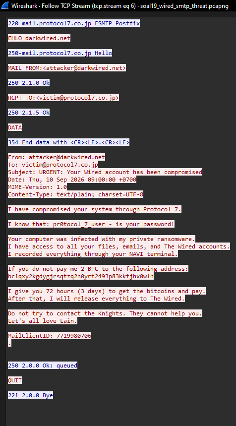

#### B. Tabel Artefak & Identifikasi Kasus

| Parameter Analisis | Nilai Temuan Forensik | Keterangan & Analisis |
| :--- | :--- | :--- |
| **Email Korban (Victim)** | `victim@protocol7.co.jp` | Alamat penerima email ancaman |
| **Password Korban yang Bocor** | `pr0tocol_7_user` | Kata sandi korban yang dicantumkan pelaku dalam pesan |
| **Jenis Malware yang Diklaim** | `Private ransomware` | Perangkat perusak yang diklaim telah menginfeksi sistem korban |
| **Batas Waktu Pembayaran** | `72 hours` | Tenggat waktu pembayaran tebusan sebelum data dibocorkan |
| **MailClientID Unik** | `7719980706` | Pengenal unik pelacakan email pada header/body |
| **Alamat Dompet Bitcoin** | `bc1qxy2kgdygjrsqtzq2n0yrf2493p83kkfjhx0wlh` | Rekening kripto penampung dana pemerasan |

#### C. Validasi Jawaban ke Socket Server (`nc 10.4.89.246 3406`)

Seluruh parameter temuan divalidasi ke socket server validator:

```text
$ nc 10.4.89.246 3406

===== Soal 19 - Protocol 7: SMTP Extortion Investigation =====
Difficulty: Hard

What is the email address of the targeted victim receiving the extortion email?
Format: email@domain.com
> victim@protocol7.co.jp

What leaked password belonging to the victim was mentioned in the email body?
Format: string
> pr0tocol_7_user

What malware was allegedly installed on the victim system according to the attacker?
Format: string
> Private ransomware

What is the deadline given by the attacker to make the payment?
Format: string (e.g., 24 hours, 48 hours)
> 72 hours

What is the unique MailClientID embedded in the email?
Format: string
> 7719980706

Congratulations! Here is your flag: KOMJAR26{SMTP_Ext0rt10n_ky9PevPp7GT07MgbRp8bexejo}
```

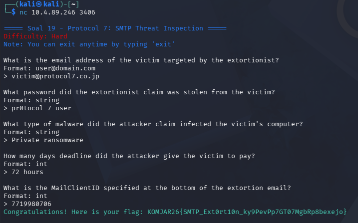

> **Flag Soal 19**: `KOMJAR26{SMTP_Ext0rt10n_ky9PevPp7GT07MgbRp8bexejo}`

---

### 20. Dekripsi Lalu Lintas Terenkripsi TLS/HTTPS (wired_tls_decrypt)

Kasus ini berfokus pada teknik dekripsi lalu lintas terenkripsi TLS/HTTPS menggunakan berkas tangkapan `wired_tls_decrypt.pcapng` dan berkas kunci rahasia (*pre-master secret*) `keyslogfile.txt`.

#### A. Prosedur Konfigurasi Dekripsi TLS di Wireshark

1. Membuka aplikasi **Wireshark** dan memuat berkas tangkapan paket `wired_tls_decrypt.pcapng`.
2. Mengonfigurasi kunci dekripsi melalui menu **Edit > Preferences > Protocols > TLS**, lalu memasukkan path berkas `keyslogfile.txt` pada kolom *(Pre)-Master-Secret log filename*.
3. Setelah kunci dimuat, Wireshark secara otomatis mendekripsi payload HTTPS/TLS dan menyingkap paket HTTP yang sebelumnya tersandi.

#### B. Tabel Artefak & Identifikasi Parameter Sesi

| Parameter Sesi | Nilai Temuan Forensik | Keterangan & Analisis |
| :--- | :--- | :--- |
| **Versi Protokol TLS** | `TLSv1.2` | Versi TLS hasil negosiasi *Client/Server Hello* |
| **Nama Domain (SNI / Host)** | `example.com` | Ekstensi *Server Name Indication* pada *Client Hello* |
| **IP Address Server HTTPS** | `93.184.216.34` | Alamat IP publik tujuan komunikasi HTTPS |
| **User-Agent Klien** | `curl/7.62.0` | Header HTTP klien yang terlihat setelah didekripsi |
| **Metode & Path HTTP** | `HEAD /` | Perintah permintaan HTTP yang dikirimkan di dalam terowongan TLS |

#### C. Validasi Jawaban ke Socket Server (`nc 10.4.89.246 3407`)

Seluruh parameter sesi terdekripsi divalidasi ke socket server validator:

```text
$ nc 10.4.89.246 3407

===== Soal 20 - Protocol 7: Decrypting the Wired TLS =====
Difficulty: Hard

What TLS protocol version was used in the encrypted session?
Format: TLSvx.x (e.g., TLSv1.2, TLSv1.3)
> TLSv1.2

What is the Server Name Indication (SNI) / Host requested in the TLS session?
Format: domain.com
> example.com

What is the IP address of the destination server?
Format: IP
> 93.184.216.34

What User-Agent string was used by the client in the decrypted HTTP request?
Format: string
> curl/7.62.0

What HTTP request method and path was sent inside the decrypted TLS tunnel?
Format: METHOD /path (e.g., GET /index.html)
> HEAD /

Congratulations! Here is your flag: KOMJAR26{TLS_D3crypt_I3ClCJIPxEe7hcQsjl6BwC8I4}
```

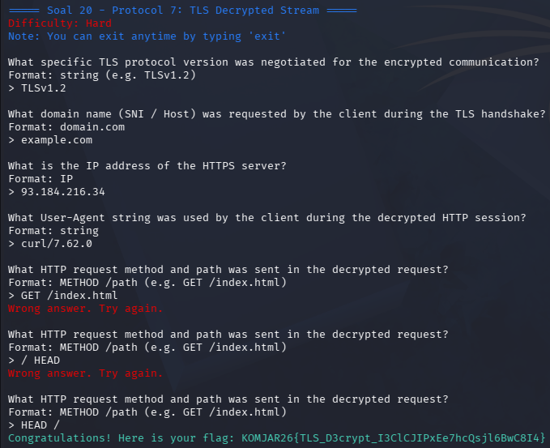

> **Flag Soal 20**: `KOMJAR26{TLS_D3crypt_I3ClCJIPxEe7hcQsjl6BwC8I4}`

